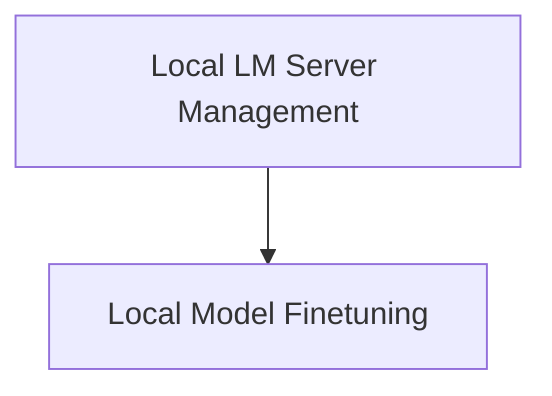

# `local_lm_provider` Module Documentation

## Introduction

The `local_lm_provider` module in DSPy is responsible for managing interactions with local language models. It provides functionalities for launching and killing local LM servers using SGLang, as well as facilitating the finetuning of these models. This module aims to offer a seamless experience for developers who wish to utilize or fine-tune language models running in their local environment.

## Architecture Overview

The `local_lm_provider` module is structured into two main sub-modules, each handling distinct aspects of local LM management and finetuning. The architecture is designed to provide clear separation of concerns, ensuring maintainability and extensibility.

<!-- DIAGRAM_JSON
{
    "direction": "TD",
    "nodes": [
        {"id": "local_lm_management", "label": "Local LM Server Management", "type": "module", "link": "local_lm_management.md"},
        {"id": "local_finetuning", "label": "Local Model Finetuning", "type": "module", "link": "local_finetuning.md"}
    ],
    "edges": [
        {"source": "local_lm_management", "target": "local_finetuning"}
    ],
    "groups": []
}
-->

## High-Level Functionality

### [Local LM Server Management](local_lm_management.md)

This sub-module focuses on the operational aspects of running local language models. It includes utilities for launching an SGLang server to host a local LM and for gracefully terminating the running server process.

### [Local Model Finetuning](local_finetuning.md)

The `local_finetuning` sub-module provides the necessary tools and processes for finetuning local language models. It handles data preparation, training execution, and managing the output of finetuning jobs.