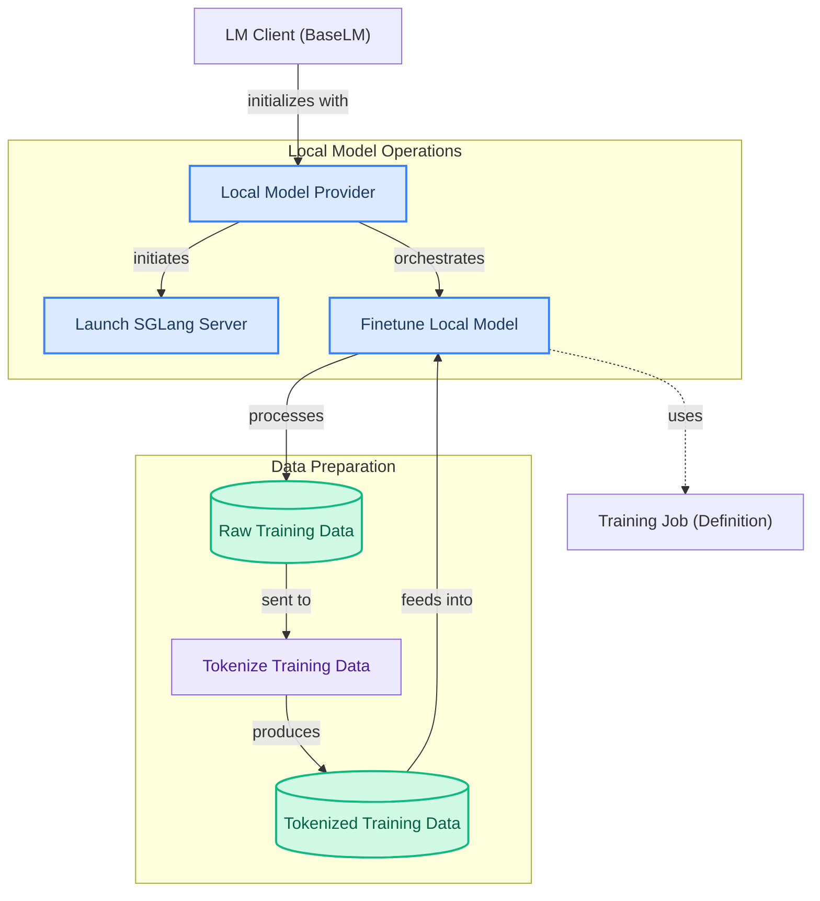

# Local Model Management
This module enables the management of local language models, offering functionalities to launch and terminate local SGLang servers, and to finetune these models using provided training data.

<!-- DIAGRAM_JSON
{
    "direction": "TD",
    "nodes": [
        {
            "id": "local_provider",
            "label": "Local Model Provider",
            "type": "component",
            "link": null
        },
        {
            "id": "launch_server",
            "label": "Launch SGLang Server",
            "type": "component",
            "link": null
        },
        {
            "id": "finetune_model",
            "label": "Finetune Local Model",
            "type": "component",
            "link": null
        },
        {
            "id": "tokenize_data",
            "label": "Tokenize Training Data",
            "type": "component",
            "link": null
        },
        {
            "id": "lm_client",
            "label": "LM Client (BaseLM)",
            "type": "external",
            "link": "lm_clients.md"
        },
        {
            "id": "training_job",
            "label": "Training Job (Definition)",
            "type": "external",
            "link": "openai_training_jobs.md"
        },
        {
            "id": "raw_data",
            "label": "Raw Training Data",
            "type": "data",
            "link": null
        },
        {
            "id": "tokenized_data",
            "label": "Tokenized Training Data",
            "type": "data",
            "link": null
        }
    ],
    "edges": [
        {
            "source": "lm_client",
            "target": "local_provider",
            "label": "initializes with"
        },
        {
            "source": "local_provider",
            "target": "launch_server",
            "label": "initiates"
        },
        {
            "source": "local_provider",
            "target": "finetune_model",
            "label": "orchestrates"
        },
        {
            "source": "finetune_model",
            "target": "training_job",
            "label": "uses"
        },
        {
            "source": "finetune_model",
            "target": "raw_data",
            "label": "processes"
        },
        {
            "source": "raw_data",
            "target": "tokenize_data",
            "label": "sent to"
        },
        {
            "source": "tokenize_data",
            "target": "tokenized_data",
            "label": "produces"
        },
        {
            "source": "tokenized_data",
            "target": "finetune_model",
            "label": "feeds into"
        }
    ],
    "groups": [
        {
            "id": "model_ops",
            "label": "Local Model Operations",
            "role": "surface",
            "nodes": [
                "local_provider",
                "launch_server",
                "finetune_model"
            ]
        },
        {
            "id": "data_prep",
            "label": "Data Preparation",
            "role": "analytical",
            "nodes": [
                "raw_data",
                "tokenize_data",
                "tokenized_data"
            ]
        }
    ]
}
-->
