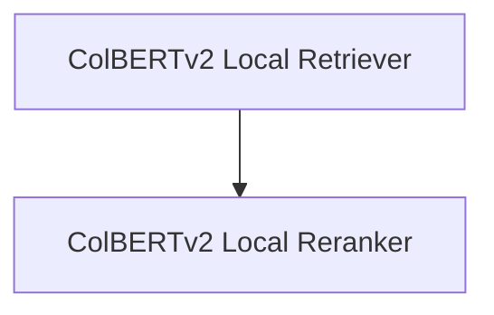

# Local Retrieval and Reranking Module

## Introduction

The `local_retrieval_and_reranking` module provides local capabilities for document retrieval and reranking using the ColBERTv2 model. It enables efficient searching of document collections and subsequent reordering of results to enhance relevance based on a given query. This module is designed for scenarios where local processing of retrieval and reranking tasks is preferred or necessary.

## Architecture Overview

The module is composed of two primary sub-modules: the `ColBERTv2 Local Retriever` and the `ColBERTv2 Local Reranker`. The retriever is responsible for indexing a collection of passages and performing initial searches to fetch relevant documents. The reranker then takes these retrieved passages and re-scores them against the query to provide a more refined ordering.

<!-- DIAGRAM_JSON
{
    "direction": "TD",
    "nodes": [
        {"id": "colbert_retriever_local", "label": "ColBERTv2 Local Retriever", "type": "module", "link": "colbert_retriever_local.md"},
        {"id": "colbert_reranker_local", "label": "ColBERTv2 Local Reranker", "type": "module", "link": "colbert_reranker_local.md"}
    ],
    "edges": [
        {"source": "colbert_retriever_local", "target": "colbert_reranker_local", "label": "Retrieved Passages"}
    ],
    "groups": []
}
-->

## Sub-modules

### [ColBERTv2 Local Retriever](colbert_retriever_local.md)
Provides local document retrieval capabilities using the ColBERTv2 model, building and searching indices locally.

### [ColBERTv2 Local Reranker](colbert_reranker_local.md)
Implements local reranking of passages using ColBERTv2 to improve the relevance of retrieved documents.