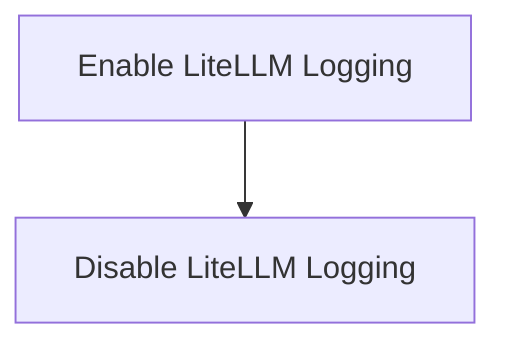

# Logging Control Module

The `logging_control` module provides functionalities to enable and disable debug logging for the LiteLLM client within the DSPy framework. It allows developers to easily switch between detailed debug output and a more concise error-only logging.

## Architecture

The `logging_control` module consists of two primary functions, each responsible for managing the LiteLLM client's logging state. These functions directly interact with the LiteLLM library to modify its logging behavior.

<!-- DIAGRAM_JSON
{
    "direction": "TD",
    "nodes": [
        {"id": "enable_logging_functionality", "label": "Enable LiteLLM Logging", "type": "module", "link": "enable_logging_functionality.md"},
        {"id": "disable_logging_functionality", "label": "Disable LiteLLM Logging", "type": "module", "link": "disable_logging_functionality.md"}
    ],
    "edges": [
        {"source": "enable_logging_functionality", "target": "disable_logging_functionality"}
    ],
    "groups": []
}
-->

## Sub-modules

*   [Enable LiteLLM Logging](enable_logging_functionality.md): Handles enabling debug logging for LiteLLM.
*   [Disable LiteLLM Logging](disable_logging_functionality.md): Handles disabling debug logging for LiteLLM.
