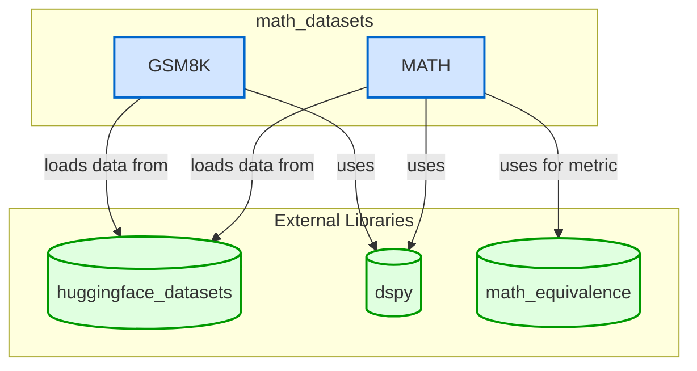

# math_datasets
This module provides classes for loading and preparing mathematical reasoning datasets, specifically GSM8K and MATH, for use within the DSPy framework. It handles data fetching, preprocessing, and splitting into train, dev, and test sets.

<!-- DIAGRAM_JSON
{
  "nodes": [
    {"id": "GSM8K", "label": "GSM8K", "type": "class"},
    {"id": "MATH", "label": "MATH", "type": "class"},
    {"id": "huggingface_datasets", "label": "huggingface_datasets", "type": "library"},
    {"id": "dspy", "label": "dspy", "type": "library"},
    {"id": "math_equivalence", "label": "math_equivalence", "type": "library"}
  ],
  "edges": [
    {"source": "GSM8K", "target": "huggingface_datasets", "label": "loads data from"},
    {"source": "GSM8K", "target": "dspy", "label": "uses"},
    {"source": "MATH", "target": "huggingface_datasets", "label": "loads data from"},
    {"source": "MATH", "target": "dspy", "label": "uses"},
    {"source": "MATH", "target": "math_equivalence", "label": "uses for metric"}
  ],
  "groups": [
    {"id": "math_datasets", "label": "math_datasets", "contains": ["GSM8K", "MATH"]},
    {"id": "External Libraries", "label": "External Libraries", "contains": ["huggingface_datasets", "dspy", "math_equivalence"]}
  ]
}
-->
