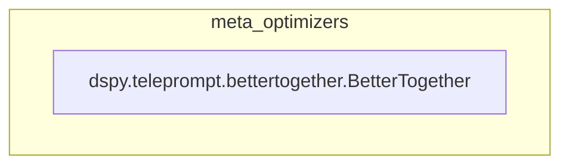

# meta_optimizers
A meta-optimizer module containing `BetterTogether`, which combines prompt and weight optimization in configurable sequences to iteratively improve student programs.

<!-- DIAGRAM_JSON
{
  "nodes": [
    {
      "id": "BetterTogether",
      "label": "dspy.teleprompt.bettertogether.BetterTogether",
      "type": "class"
    }
  ],
  "edges": [],
  "groups": [
    {
      "id": "meta_optimizers",
      "label": "meta_optimizers",
      "nodes": [
        "BetterTogether"
      ]
    }
  ]
}
-->
