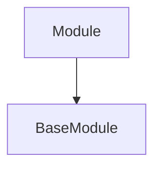

# module_core
This module defines the foundational `BaseModule` for DSPy programs and the core `Module` class, which extends `BaseModule` to provide program logic and optimization capabilities.

<!-- DIAGRAM_JSON
{
  "nodes": [
    {"id": "dspy.primitives.base_module.BaseModule", "label": "BaseModule"},
    {"id": "dspy.primitives.module.Module", "label": "Module"}
  ],
  "edges": [
    {"source": "dspy.primitives.module.Module", "target": "dspy.primitives.base_module.BaseModule", "label": "inherits"}
  ],
  "groups": []
}
-->
