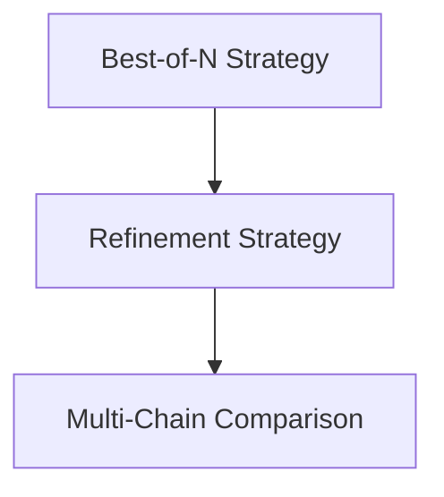

# Module Optimization

## Introduction
The `module_optimization` module provides advanced strategies for optimizing the performance and reliability of prediction modules within the DSPy framework. It includes techniques like running a module multiple times to select the best outcome (`BestOfN`), iteratively refining predictions based on feedback (`Refine`), and comparing multiple reasoning chains (`MultiChainComparison`).

## Architecture Overview
The `module_optimization` module is structured into three main sub-modules, each addressing a distinct optimization strategy: `best_of_n_strategy`, `refinement_strategy`, and `multi_chain_comparison`. These sub-modules interact with core DSPy components, such as `Module` and `Signature`, to enhance prediction quality.

## High-Level Functionality

*   **Best-of-N Strategy ([best_of_n_strategy.md](best_of_n_strategy.md)):** This sub-module focuses on improving prediction quality by executing a given module multiple times and selecting the best result based on a defined reward function.
*   **Refinement Strategy ([refinement_strategy.md](refinement_strategy.md)):** This sub-module enables iterative refinement of module predictions using feedback mechanisms. It includes components for adapting module behavior and generating concrete advice to correct mistakes.
*   **Multi-Chain Comparison ([multi_chain_comparison.md](multi_chain_comparison.md)):** This sub-module facilitates comparing different reasoning attempts to arrive at a more robust and accurate final prediction.

<!-- DIAGRAM_JSON
{
    "direction": "TD",
    "nodes": [
        {"id": "best_of_n_strategy", "label": "Best-of-N Strategy", "type": "module", "link": "best_of_n_strategy.md"},
        {"id": "refinement_strategy", "label": "Refinement Strategy", "type": "module", "link": "refinement_strategy.md"},
        {"id": "multi_chain_comparison", "label": "Multi-Chain Comparison", "type": "module", "link": "multi_chain_comparison.md"}
    ],
    "edges": [
        {"source": "best_of_n_strategy", "target": "refinement_strategy"},
        {"source": "refinement_strategy", "target": "multi_chain_comparison"}
    ],
    "groups": []
}
-->

