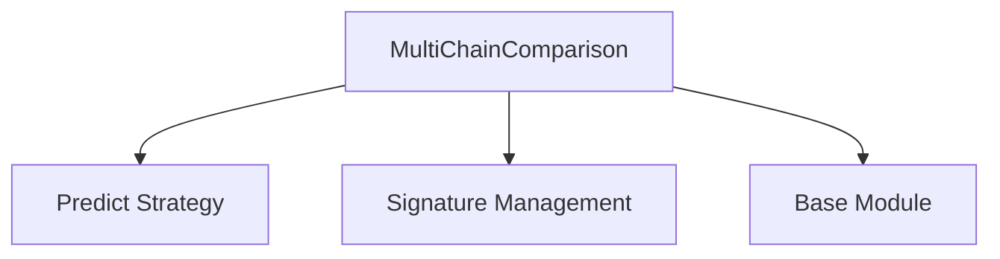

# multi_chain_comparison

## Introduction

The `multi_chain_comparison` module provides the `MultiChainComparison` prediction strategy, a powerful DSPy module designed to improve the robustness and accuracy of language model outputs by comparing and synthesizing multiple reasoning attempts. This module is particularly useful in scenarios where a single-pass prediction might be insufficient, allowing for a more deliberate and refined decision-making process based on diverse perspectives.

## Core Functionality

The `MultiChainComparison` strategy operates by taking `M` different reasoning attempts (e.g., from multiple independent language model calls or different prompt variations) and consolidating them into a single, optimized output. It dynamically constructs a new signature for an internal `Predict` module, incorporating each reasoning attempt as an input field and generating a refined "rationale" and final answer.

### dspy.predict.multi_chain_comparison.MultiChainComparison

This class orchestrates the comparison and aggregation process:

-   **Initialization**: It takes a base `signature`, the number of attempts `M`, `temperature` for the internal `Predict` module, and additional configuration. It extends the provided signature to include `M` input fields for `reasoning_attempt_1` to `reasoning_attempt_M`, and prepends an output field for a synthesized `rationale`.
-   **Forward Pass (`forward` method)**: It expects a list of `completions`, where each completion represents a dictionary containing a "rationale" (or "reasoning") and the final answer based on a specific attempt. It formats these into standardized "Student Attempt" strings and then passes them to the internal `Predict` module, which is configured to produce the final, consolidated output.

## Architecture and Component Relationships

The `multi_chain_comparison` module is a leaf module within the `dspy.predict.module_optimization` sub-system. Its primary component, `MultiChainComparison`, leverages other core DSPy functionalities to achieve its goal.

<!-- DIAGRAM_JSON
{
    "direction": "TD",
    "nodes": [
        {"id": "multi_chain_comparison", "label": "MultiChainComparison", "type": "component", "link": null},
        {"id": "predict_strategy", "label": "Predict Strategy", "type": "external", "link": "dspy_prediction_strategies.md"},
        {"id": "signature_management", "label": "Signature Management", "type": "external", "link": "dspy_signatures.md"},
        {"id": "base_module", "label": "Base Module", "type": "external", "link": "dspy_primitives.md"}
    ],
    "edges": [
        {"source": "multi_chain_comparison", "target": "predict_strategy"},
        {"source": "multi_chain_comparison", "target": "signature_management"},
        {"source": "multi_chain_comparison", "target": "base_module"}
    ],
    "groups": []
}
-->

### Relationships:

-   **`MultiChainComparison`**: The central component of this module, responsible for orchestrating the multi-chain comparison process.
-   **`Predict Strategy`**: `MultiChainComparison` relies heavily on an internal `Predict` instance (from the [dspy_prediction_strategies.md](dspy_prediction_strategies.md) module) to perform the final aggregation and reasoning based on the multiple attempts.
-   **`Signature Management`**: The module interacts with DSPy's [dspy_signatures.md](dspy_signatures.md) to dynamically construct and modify prediction signatures, adding input fields for each reasoning attempt and an output field for the consolidated rationale.
-   **`Base Module`**: As a core DSPy component, `MultiChainComparison` inherits from `dspy.primitives.module.Module` (from [dspy_primitives.md](dspy_primitives.md)), adhering to the standard DSPy module interface.

## Integration with the Overall System

The `multi_chain_comparison` module is an integral part of the `dspy_prediction_strategies` ecosystem, specifically falling under [module_optimization](module_optimization.md). It serves as an advanced prediction strategy designed to enhance the quality of predictions by incorporating a comparative analysis of multiple initial responses. This allows for more robust and reliable AI systems, especially in tasks requiring critical reasoning or where uncertainty is high.

By providing a structured way to evaluate and synthesize multiple outputs, `MultiChainComparison` contributes to building more sophisticated and resilient DSPy programs. It complements other strategies within `module_optimization` by offering a mechanism for refining outputs through collaborative comparison, leading to improved performance and accuracy across various language model applications.