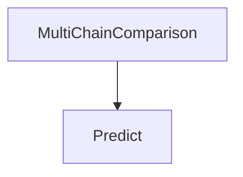

# MultiChainComparison Module
This module facilitates comparing and synthesizing multiple reasoning attempts or completions. It uses an internal `Predict` module to generate a refined, consensus-based output by analyzing diverse inputs.

<!-- DIAGRAM_JSON
{
  "nodes": [
    {
      "id": "MultiChainComparison",
      "label": "MultiChainComparison",
      "type": "module"
    },
    {
      "id": "Predict",
      "label": "Predict",
      "type": "module"
    }
  ],
  "edges": [
    {
      "source": "MultiChainComparison",
      "target": "Predict",
      "label": "uses"
    }
  ],
  "groups": []
}
-->
