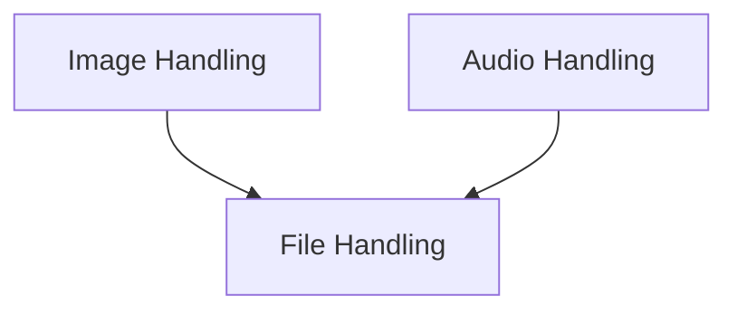

# Multimedia Data Types Module

The `multimedia_data_types` module within `dspy.adapters.types` provides a robust set of classes and utilities for handling various multimedia and file types within the DSPy framework. It abstracts away the complexities of encoding, decoding, and formatting different data formats, making it easier for developers to integrate audio, image, and general file inputs into their DSPy programs.

## Architecture Overview

The module is structured into several key sub-modules, each responsible for a specific data type or set of functionalities:

<!-- DIAGRAM_JSON
{
    "direction": "TD",
    "nodes": [
        {"id": "audio_handling", "label": "Audio Handling", "type": "module", "link": "audio_handling.md"},
        {"id": "image_handling", "label": "Image Handling", "type": "module", "link": "image_handling.md"},
        {"id": "file_handling", "label": "File Handling", "type": "module", "link": "file_handling.md"}
    ],
    "edges": [
        {"source": "image_handling", "target": "file_handling"},
        {"source": "audio_handling", "target": "file_handling"}
    ],
    "groups": []
}
-->

## Sub-modules

### [Audio Handling](audio_handling.md)
This sub-module focuses on processing and managing audio data, providing functionalities to encode and format audio for use within DSPy programs. It supports various methods for creating audio objects, including from URLs, local files, and raw audio arrays.

### [Image Handling](image_handling.md)
Dedicated to handling image data, this sub-module offers tools for processing images from different sources like URLs, file paths, and PIL image objects. It includes utilities for image encoding, validation, and extracting file extensions.

### [File Handling](file_handling.md)
This sub-module provides a generalized interface for interacting with various file types. It enables the creation of file objects from local paths, raw bytes, or existing file IDs, and facilitates their encoding into data URIs for seamless integration into DSPy operations.
