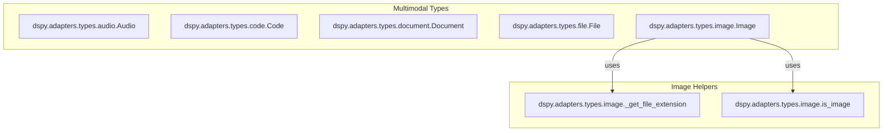

# multimodal_types
This module defines various data types for handling multimodal inputs and outputs in DSPy, including audio, code, documents, files, and images. These types facilitate structured interaction with language models for diverse data formats.

<!-- DIAGRAM_JSON
{
    "nodes": [
        {
            "id": "Audio",
            "label": "Audio",
            "type": "class"
        },
        {
            "id": "Code",
            "label": "Code",
            "type": "class"
        },
        {
            "id": "Document",
            "label": "Document",
            "type": "class"
        },
        {
            "id": "File",
            "label": "File",
            "type": "class"
        },
        {
            "id": "Image",
            "label": "Image",
            "type": "class"
        },
        {
            "id": "_get_file_extension",
            "label": "_get_file_extension",
            "type": "function"
        },
        {
            "id": "is_image",
            "label": "is_image",
            "type": "function"
        }
    ],
    "edges": [
        {
            "source": "Image",
            "target": "_get_file_extension",
            "label": "uses"
        },
        {
            "source": "Image",
            "target": "is_image",
            "label": "uses"
        }
    ],
    "groups": [
        {
            "id": "Multimodal Types",
            "label": "Multimodal Types",
            "nodes": [
                "Audio",
                "Code",
                "Document",
                "File",
                "Image"
            ]
        },
        {
            "id": "Image Helpers",
            "label": "Image Helpers",
            "nodes": [
                "_get_file_extension",
                "is_image"
            ]
        }
    ]
}
-->
