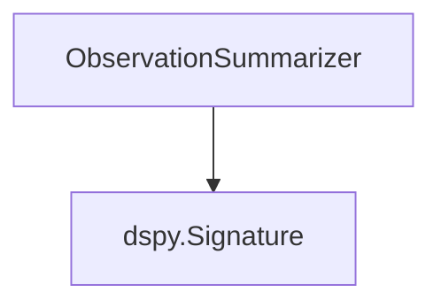

# observation_summarization Module Documentation

## Introduction
The `observation_summarization` module is a key part of the `dspy.propose.dataset_summary_generator` sub-module within the DSPy framework. Its primary responsibility is to provide a structured way to summarize qualitative observations made about a dataset into a concise and informative summary.

## Module Purpose and Core Functionality
This module is designed to streamline the process of distilling complex or numerous dataset observations into actionable insights. By using the `ObservationSummarizer` signature, developers can automatically generate a brief summary highlighting only the most critical details from a given set of observations. This is particularly useful in scenarios where a quick overview of dataset characteristics or issues is needed for further program proposal, analysis, or debugging.

The core functionality revolves around the `ObservationSummarizer` class, which acts as a prompt template for language models to perform the summarization task.

## Architecture and Component Relationships

<!-- DIAGRAM_JSON
{
    "direction": "TD",
    "nodes": [
        {"id": "observation_summarizer", "label": "ObservationSummarizer", "type": "component", "link": null},
        {"id": "dspy_signature", "label": "dspy.Signature", "type": "external", "link": "dspy_signatures.md"}
    ],
    "edges": [
        {"source": "observation_summarizer", "target": "dspy_signature"}
    ],
    "groups": []
}
-->

### Component Breakdown

#### ObservationSummarizer
- **Location**: `dspy.propose.dataset_summary_generator.ObservationSummarizer`
- **Description**: This is a `dspy.Signature` class designed to take a string of observations about a dataset as input and produce a 2-3 sentence summary of the most important details as output. It leverages DSPy's foundational `Signature` primitive for defining language model tasks.
- **Inputs**:
    - `observations`: A string describing observations made about a dataset.
- **Outputs**:
    - `summary`: A concise 2-3 sentence summary of the significant highlights from the observations.
- **Usage**: Typically used as a declarative prompt within a DSPy program to guide a language model in summarizing dataset characteristics.

## How the Module Fits into the Overall System
The `observation_summarization` module is an integral part of the `dspy_program_proposal` ecosystem, specifically within `dataset_analysis`. It provides a crucial initial step in understanding and documenting dataset properties. The summaries generated by `ObservationSummarizer` can feed into other modules for:
-   **Dataset Description Generation**: Providing high-level insights to components like [dataset_observation_generation](dataset_observation_generation.md) for generating more comprehensive dataset descriptors.
-   **Program Proposal**: Informing the `program_description_and_instruction` module by offering a concise understanding of the dataset's nature, which can influence how programs are designed or adapted.
-   **Debugging and Iteration**: Quickly understanding the impact of data changes or issues during the development and iteration of DSPy programs.

By providing a structured and automated way to summarize observations, this module enhances the efficiency and effectiveness of dataset analysis and subsequent program development within the DSPy framework.
