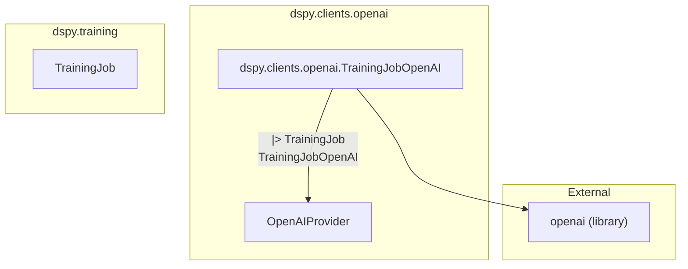

# openai_training_jobs
This module defines `TrainingJobOpenAI`, a specialized class for managing OpenAI fine-tuning jobs. It handles job cancellation and status retrieval by interacting with the OpenAI API and a dedicated provider.

<!-- DIAGRAM_JSON
{
  "nodes": [
    {
      "id": "TrainingJobOpenAI",
      "label": "TrainingJobOpenAI",
      "metadata": {
        "type": "class"
      }
    },
    {
      "id": "TrainingJob",
      "label": "TrainingJob",
      "metadata": {
        "type": "class"
      }
    },
    {
      "id": "OpenAIProvider",
      "label": "OpenAIProvider",
      "metadata": {
        "type": "class"
      }
    },
    {
      "id": "openai",
      "label": "openai",
      "metadata": {
        "type": "library"
      }
    }
  ],
  "edges": [
    {
      "source": "TrainingJobOpenAI",
      "target": "TrainingJob",
      "label": "inherits",
      "metadata": {
        "type": "inheritance"
      }
    },
    {
      "source": "TrainingJobOpenAI",
      "target": "OpenAIProvider",
      "label": "uses",
      "metadata": {
        "type": "dependency"
      }
    },
    {
      "source": "TrainingJobOpenAI",
      "target": "openai",
      "label": "uses",
      "metadata": {
        "type": "dependency"
      }
    }
  ],
  "groups": [
    {
      "id": "dspy.clients.openai",
      "label": "dspy.clients.openai",
      "nodes": ["TrainingJobOpenAI", "OpenAIProvider"]
    },
    {
      "id": "dspy.training",
      "label": "dspy.training",
      "nodes": ["TrainingJob"]
    },
    {
      "id": "External",
      "label": "External",
      "nodes": ["openai"]
    }
  ]
}
-->
