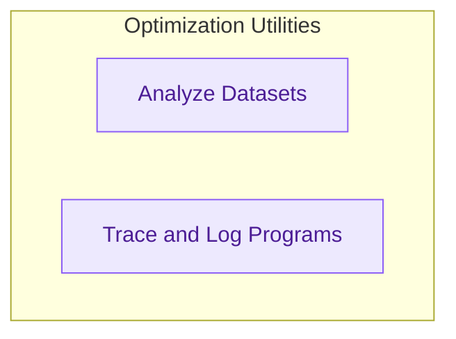

# Optimization Utilities
Provides foundational utilities for program optimization, including tools for dataset analysis, summarizing observations, tracing program execution, and logging performance metrics.

<!-- DIAGRAM_JSON
{
    "direction": "TD",
    "nodes": [
        {
            "id": "optimization_utilities",
            "label": "Optimization Utilities",
            "type": "module"
        },
        {
            "id": "dataset_analysis",
            "label": "Analyze Datasets",
            "type": "module",
            "link": "dataset_analysis.md"
        },
        {
            "id": "program_tracing_and_logging",
            "label": "Trace and Log Programs",
            "type": "module",
            "link": "program_tracing_and_logging.md"
        }
    ],
    "edges": [],
    "groups": [
        {
            "id": "optimization_utilities_group",
            "label": "Optimization Utilities",
            "role": "analytical",
            "nodes": [
                "dataset_analysis",
                "program_tracing_and_logging"
            ]
        }
    ]
}
-->
