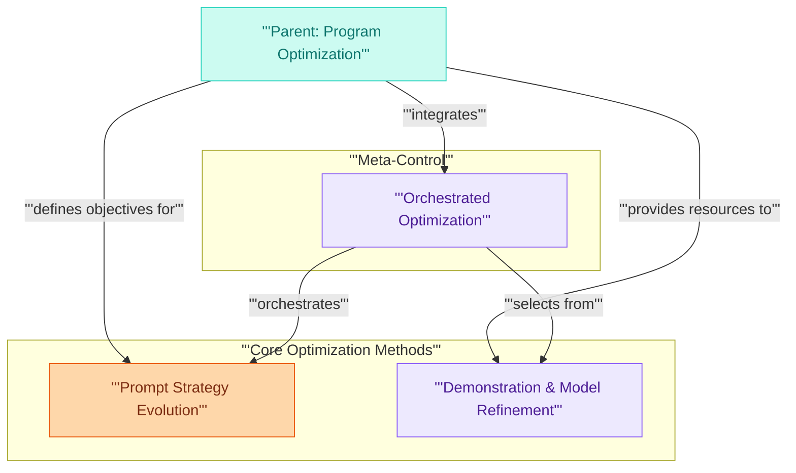

# Optimizers Module

This module provides a suite of advanced teleprompters for optimizing DSPy programs, encompassing strategies for prompt evolution, few-shot demonstration management, and fine-tuning, to significantly enhance program performance.

<!-- DIAGRAM_JSON
{
    "direction": "TD",
    "nodes": [
        {
            "id": "program_optimization_parent",
            "label": "Parent: Program Optimization",
            "type": "external"
        },
        {
            "id": "prompt_strategies",
            "label": "Prompt Strategy Evolution",
            "type": "module",
            "link": "prompt_strategies.md"
        },
        {
            "id": "demo_and_finetune",
            "label": "Demonstration & Model Refinement",
            "type": "module",
            "link": "demo_and_finetune.md"
        },
        {
            "id": "meta_optimizers",
            "label": "Orchestrated Optimization",
            "type": "module",
            "link": "meta_optimizers.md"
        }
    ],
    "edges": [
        {
            "source": "program_optimization_parent",
            "target": "prompt_strategies",
            "label": "defines objectives for"
        },
        {
            "source": "program_optimization_parent",
            "target": "demo_and_finetune",
            "label": "provides resources to"
        },
        {
            "source": "program_optimization_parent",
            "target": "meta_optimizers",
            "label": "integrates"
        },
        {
            "source": "meta_optimizers",
            "target": "prompt_strategies",
            "label": "orchestrates"
        },
        {
            "source": "meta_optimizers",
            "target": "demo_and_finetune",
            "label": "selects from"
        }
    ],
    "groups": [
        {
            "id": "core_optimization_methods",
            "label": "Core Optimization Methods",
            "role": "analytical",
            "nodes": [
                "prompt_strategies",
                "demo_and_finetune"
            ]
        },
        {
            "id": "meta_control",
            "label": "Meta-Control",
            "role": "generative",
            "nodes": [
                "meta_optimizers"
            ]
        }
    ]
}
-->
