DSPy is a framework for building, optimizing, and evaluating language model (LLM) programs. It empowers developers to move beyond simple prompt engineering by providing a systematic and declarative approach to constructing complex LLM applications. DSPy focuses on composable modules, explicit program flow, and automated optimization (teleprompting) to achieve higher performance and reliability.

**Who is this software for? What problem does it solve?**
DSPy is for developers, researchers, and engineers who want to build robust and high-performing applications powered by large language models. It solves the problem of "prompt engineering" by replacing manual prompt crafting with a programmatic approach. Instead of guessing the right prompts, users define the *structure* of their LLM program and the *desired outputs*, and DSPy automatically optimizes the prompts and weights (few-shot examples) to achieve better results on specific tasks. This makes LLM development more systematic, reproducible, and efficient.

**How would a new user or developer actually use it?**
A new user would typically follow these steps:
1.  **Define their LLM program:** They start by defining their task as a series of DSPy `Module`s, each with a `Signature` that specifies its inputs and outputs. This is similar to defining functions in traditional programming.
2.  **Connect to Language Models and Retrievers:** They configure their preferred LLM (e.g., OpenAI, local models) and any necessary retrieval models (e.g., ColBERTv2, Weaviate) using DSPy's integration layer.
3.  **Compose Modules:** They combine these `Module`s into a larger DSPy program, defining the flow of information and reasoning steps.
4.  **Optimize the Program:** Instead of manually writing prompts, they use DSPy's "teleprompters" (optimizers) to automatically generate and refine the prompts and few-shot examples for their program based on a small dataset and a defined metric.
5.  **Evaluate Performance:** They evaluate the optimized program's performance using DSPy's evaluation tools and metrics on a test dataset.

**What are the 3-4 main things someone does with this system?**
1.  **Build LLM Programs:** Define and compose modular LLM components with clear input/output signatures.
2.  **Integrate LMs and Data Sources:** Connect to various language models and retrieval systems.
3.  **Automate Optimization:** Use teleprompters to automatically generate and refine prompts and few-shot examples.
4.  **Evaluate and Benchmark:** Measure program performance using diverse metrics and datasets.

<!-- DIAGRAM_JSON
{
    "direction": "LR",
    "nodes": [
        {
            "id": "core_program_building_node",
            "label": "Core Program Building",
            "type": "module",
            "link": "core_program_building.md"
        },
        {
            "id": "data_evaluation_node",
            "label": "Data and Evaluation",
            "type": "module",
            "link": "data_and_evaluation.md"
        },
        {
            "id": "lm_integration_node",
            "label": "Language Model Integration",
            "type": "module",
            "link": "language_model_integration.md"
        },
        {
            "id": "program_optimization_node",
            "label": "Program Optimization",
            "type": "module",
            "link": "program_optimization.md"
        },
        {
            "id": "user",
            "label": "User",
            "type": "component"
        },
        {
            "id": "utilities_adapters_node",
            "label": "Utilities and Adapters",
            "type": "module",
            "link": "utilities_and_adapters.md"
        }
    ],
    "edges": [
        {
            "source": "user",
            "target": "core_program_building_node",
            "label": "defines & runs"
        },
        {
            "source": "core_program_building_node",
            "target": "lm_integration_node",
            "label": "executes via"
        },
        {
            "source": "lm_integration_node",
            "target": "data_evaluation_node",
            "label": "logs interactions"
        },
        {
            "source": "core_program_building_node",
            "target": "program_optimization_node",
            "label": "optimizes with"
        },
        {
            "source": "program_optimization_node",
            "target": "core_program_building_node",
            "label": "returns optimized program"
        },
        {
            "source": "program_optimization_node",
            "target": "data_evaluation_node",
            "label": "uses datasets & metrics"
        },
        {
            "source": "data_evaluation_node",
            "target": "program_optimization_node",
            "label": "provides feedback"
        },
        {
            "source": "utilities_adapters_node",
            "target": "core_program_building_node",
            "label": "supports"
        },
        {
            "source": "utilities_adapters_node",
            "target": "lm_integration_node",
            "label": "provides adapters for"
        }
    ],
    "groups": [
        {
            "id": "program_definition",
            "label": "Program Definition",
            "nodes": [
                "core_program_building_node"
            ]
        },
        {
            "id": "lm_and_retrieval",
            "label": "LM and Retrieval Integration",
            "nodes": [
                "lm_integration_node"
            ]
        },
        {
            "id": "optimization_engine",
            "label": "Program Optimization Engine",
            "nodes": [
                "program_optimization_node"
            ]
        },
        {
            "id": "data_and_metrics",
            "label": "Data and Evaluation Metrics",
            "nodes": [
                "data_evaluation_node"
            ]
        },
        {
            "id": "support_utilities",
            "label": "Utilities and Adapters",
            "nodes": [
                "utilities_adapters_node"
            ]
        }
    ],
    "_auto_generated": "r1_overview_synthesis"
}
-->

```mermaid
flowchart LR
    user(("User"))
    user ==>|"defines & runs"| core_program_building_node

    subgraph program_definition["Program Definition"]
        core_program_building_node["Core Program Building"]
    end

    subgraph lm_and_retrieval["LM and Retrieval Integration"]
        lm_integration_node["Language Model Integration"]
    end

    subgraph optimization_engine["Program Optimization Engine"]
        program_optimization_node["Program Optimization"]
    end

    subgraph data_and_metrics["Data and Evaluation Metrics"]
        data_evaluation_node["Data and Evaluation"]
    end

    subgraph support_utilities["Utilities and Adapters"]
        utilities_adapters_node["Utilities and Adapters"]
    end

    core_program_building_node ==>|"executes via"| lm_integration_node
    lm_integration_node -->|"logs interactions"| data_evaluation_node
    core_program_building_node ==>|"optimizes with"| program_optimization_node
    program_optimization_node -->|"returns optimized program"| core_program_building_node
    program_optimization_node ==>|"uses datasets & metrics"| data_evaluation_node
    data_evaluation_node -.->|"provides feedback"| program_optimization_node
    utilities_adapters_node -.->|"supports"| core_program_building_node
    utilities_adapters_node -.->|"provides adapters for"| lm_integration_node

    classDef userNode fill:#fef3c7,stroke:#d97706,stroke-width:2px,color:#92400e
    classDef surface fill:#dbeafe,stroke:#3b82f6,stroke-width:2px,color:#1e3a5f
    classDef data fill:#d1fae5,stroke:#10b981,stroke-width:2px,color:#065f46
    classDef generative fill:#fed7aa,stroke:#ea580c,stroke-width:1px,color:#7c2d12
    classDef analytical fill:#ede9fe,stroke:#8b5cf6,stroke-width:1px,color:#4c1d95

    class user userNode
    class core_program_building_node,utilities_adapters_node surface
    class lm_integration_node generative
    class program_optimization_node analytical
    class data_evaluation_node data

    click core_program_building_node "core_program_building.md" "View Core Program Building"
    click lm_integration_node "language_model_integration.md" "View Language Model Integration"
    click program_optimization_node "program_optimization.md" "View Program Optimization"
    click data_evaluation_node "data_and_evaluation.md" "View Data and Evaluation"
    click utilities_adapters_node "utilities_and_adapters.md" "View Utilities and Adapters"
```

