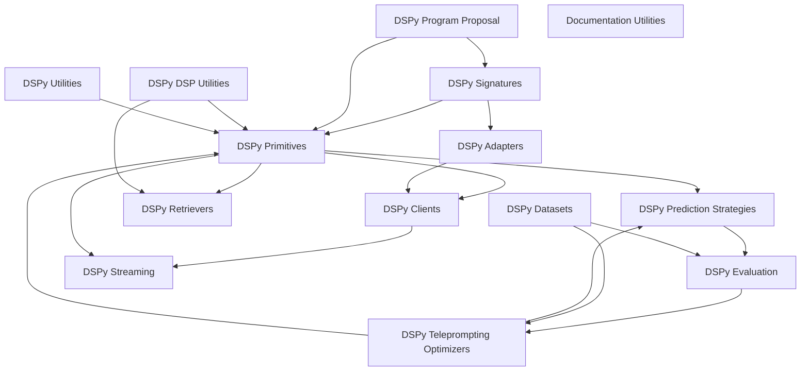

The `dspy-src` repository houses the core DSPy framework, a programming model designed for composing, compiling, and optimizing pipelines that leverage large language models (LLMs) and retrieval models (RMs). It provides declarative interfaces for defining LM programs, tools for interacting with various language models and retrieval systems, and advanced strategies for program execution, evaluation, and automated optimization (teleprompting). DSPy aims to make it easier for developers to build robust, efficient, and self-improving applications with LLMs.

### Architecture Overview

The DSPy framework is structured around a core set of components that define, execute, and optimize language model programs. It integrates with external LLM and RM providers through dedicated client and adapter modules. The architecture emphasizes a clear separation of concerns, allowing for modular development and flexible optimization strategies.

### Core Modules and Their Relationships:

*   **[DSPy Primitives](dspy_primitives.md)**: The foundational building blocks of DSPy programs, defining core modules and their lifecycle.
*   **[DSPy Signatures](dspy_signatures.md)**: Declarative interfaces that specify the input and output fields for language model calls, defining the contract for primitives.
    *   `DSPy Signatures` define `DSPy Primitives`.
*   **[DSPy Clients](dspy_clients.md)**: Provides the interface for interacting with various language models (LLMs), including caching and finetuning integrations.
    *   `DSPy Primitives` utilize `DSPy Clients` for LLM interactions.
*   **[DSPy Retrievers](dspy_retrievers.md)**: Offers a framework for integrating different retrieval mechanisms (RMs) to fetch relevant information.
    *   `DSPy Primitives` utilize `DSPy Retrievers` for context retrieval.
*   **[DSPy Adapters](dspy_adapters.md)**: Bridges DSPy signatures to specific language model clients, handling prompt formatting and output parsing.
    *   `DSPy Signatures` are adapted by `DSPy Adapters`, which then interact with `DSPy Clients`.
*   **[DSPy Prediction Strategies](dspy_prediction_strategies.md)**: Implements various techniques for program execution, such as agentic behaviors (ReAct, CodeAct) and module optimization.
    *   `DSPy Primitives` are used to build `DSPy Prediction Strategies`.
*   **[DSPy Datasets](dspy_datasets.md)**: Provides tools for handling various datasets, crucial for training, development, and evaluation.
*   **[DSPy Evaluation](dspy_evaluation.md)**: Offers a comprehensive suite of metrics for evaluating the performance of DSPy programs, including both traditional and LLM-based metrics.
    *   `DSPy Datasets` are used for `DSPy Evaluation`.
    *   `DSPy Prediction Strategies` are assessed by `DSPy Evaluation`.
*   **[DSPy Teleprompting Optimizers](dspy_teleprompting_optimizers.md)**: A suite of strategies for automatically generating, refining, and selecting prompts (instructions and few-shot examples) to optimize program performance.
    *   `DSPy Evaluation` informs `DSPy Teleprompting Optimizers`.
    *   `DSPy Datasets` are used by `DSPy Teleprompting Optimizers`.
    *   `DSPy Teleprompting Optimizers` improve `DSPy Prediction Strategies` and `DSPy Primitives`.

### Supporting Modules:

*   **[DSPy Program Proposal](dspy_program_proposal.md)**: Facilitates the generation of DSPy programs and signatures.
    *   `DSPy Program Proposal` contributes to defining `DSPy Signatures` and `DSPy Primitives`.
*   **[DSPy Streaming](dspy_streaming.md)**: Provides functionalities for handling streaming responses from language models.
    *   `DSPy Clients` and `DSPy Primitives` support `DSPy Streaming`.
*   **[DSPy DSP Utilities](dspy_dsp_utilities.md)**: Contains general utilities for DSPy, such as ColBERTv2 integration and settings management.
    *   `DSPy DSP Utilities` support `DSPy Primitives` and `DSPy Retrievers`.
*   **[DSPy Utilities](dspy_utilities.md)**: A collection of essential utility functions and classes, including asynchronous programming helpers, callback mechanisms, and dummy components for testing.
    *   `DSPy Utilities` provide general support to `DSPy Primitives` and other core modules.
*   **[Documentation Utilities](documentation_utilities.md)**: Tools designed to automate and streamline the generation and management of system documentation.