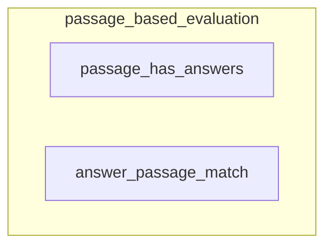

# passage_based_evaluation
This module provides functions to evaluate whether specific answers are contained within text passages, useful for retrieval-augmented generation (RAG) systems.

<!-- DIAGRAM_JSON
{
    "nodes": [
        {
            "id": "passage_has_answers",
            "label": "passage_has_answers"
        },
        {
            "id": "answer_passage_match",
            "label": "answer_passage_match"
        }
    ],
    "edges": [],
    "groups": [
        {
            "id": "passage_based_evaluation",
            "label": "passage_based_evaluation",
            "nodes": [
                "passage_has_answers",
                "answer_passage_match"
            ]
        }
    ]
}
-->
