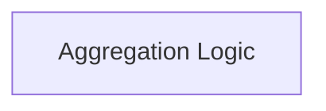

# Prediction Aggregation Module

## Introduction

The `prediction_aggregation` module in DSPy provides core functionalities for aggregating predictions from various sources. This is crucial for tasks like consolidating multiple model outputs, implementing ensemble strategies, or determining a final answer based on several predictions. It includes utilities for majority voting and default normalization of text.

## Architecture Overview

The `prediction_aggregation` module is designed to be straightforward, focusing on efficient and flexible aggregation of prediction outcomes. It currently comprises a single sub-module: `aggregation_logic`, which encapsulates the core aggregation algorithms.

<!-- DIAGRAM_JSON
{
    "direction": "TD",
    "nodes": [
        {"id": "aggregation_logic", "label": "Aggregation Logic", "type": "module", "link": "aggregation_logic.md"}
    ],
    "edges": [],
    "groups": []
}
-->

## Sub-modules

*   [Aggregation Logic](aggregation_logic.md): Handles the core logic for aggregating predictions, including majority voting and text normalization.
