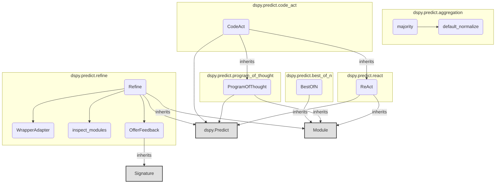

# prediction_strategies
This module offers diverse DSPy prediction strategies, encompassing aggregation (majority voting), best-of-N selection, ReAct and Program-of-Thought agents, and a robust refinement mechanism with feedback.

<!-- DIAGRAM_JSON
{
    "nodes": [
        {
            "id": "prediction_strategies",
            "label": "prediction_strategies",
            "type": "module"
        },
        {
            "id": "majority",
            "label": "majority",
            "type": "function"
        },
        {
            "id": "default_normalize",
            "label": "default_normalize",
            "type": "function"
        },
        {
            "id": "BestOfN",
            "label": "BestOfN",
            "type": "class"
        },
        {
            "id": "CodeAct",
            "label": "CodeAct",
            "type": "class"
        },
        {
            "id": "ProgramOfThought",
            "label": "ProgramOfThought",
            "type": "class"
        },
        {
            "id": "ReAct",
            "label": "ReAct",
            "type": "class"
        },
        {
            "id": "Refine",
            "label": "Refine",
            "type": "class"
        },
        {
            "id": "WrapperAdapter",
            "label": "WrapperAdapter",
            "type": "class"
        },
        {
            "id": "inspect_modules",
            "label": "inspect_modules",
            "type": "function"
        },
        {
            "id": "OfferFeedback",
            "label": "OfferFeedback",
            "type": "class"
        },
        {
            "id": "Predict",
            "label": "dspy.Predict",
            "type": "class"
        },
        {
            "id": "Module",
            "label": "Module",
            "type": "base_class"
        },
        {
            "id": "Signature",
            "label": "Signature",
            "type": "base_class"
        },
        {
            "id": "aggregation_and_feedback",
            "label": "Aggregation and Feedback Utilities",
            "type": "module",
            "link": "aggregation_and_feedback.md"
        },
        {
            "id": "core_prediction_modules",
            "label": "Core Prediction Modules",
            "type": "module",
            "link": "core_prediction_modules.md"
        }
    ],
    "edges": [
        {
            "source": "majority",
            "target": "default_normalize",
            "type": "uses"
        },
        {
            "source": "BestOfN",
            "target": "Module",
            "type": "inherits"
        },
        {
            "source": "CodeAct",
            "target": "ReAct",
            "type": "inherits"
        },
        {
            "source": "CodeAct",
            "target": "ProgramOfThought",
            "type": "inherits"
        },
        {
            "source": "CodeAct",
            "target": "Predict",
            "type": "uses"
        },
        {
            "source": "ProgramOfThought",
            "target": "Module",
            "type": "inherits"
        },
        {
            "source": "ProgramOfThought",
            "target": "Predict",
            "type": "uses"
        },
        {
            "source": "ReAct",
            "target": "Module",
            "type": "inherits"
        },
        {
            "source": "ReAct",
            "target": "Predict",
            "type": "uses"
        },
        {
            "source": "Refine",
            "target": "Module",
            "type": "inherits"
        },
        {
            "source": "Refine",
            "target": "OfferFeedback",
            "type": "uses"
        },
        {
            "source": "Refine",
            "target": "inspect_modules",
            "type": "uses"
        },
        {
            "source": "Refine",
            "target": "WrapperAdapter",
            "type": "uses"
        },
        {
            "source": "Refine",
            "target": "Predict",
            "type": "uses"
        },
        {
            "source": "OfferFeedback",
            "target": "Signature",
            "type": "inherits"
        },
        {
            "source": "prediction_strategies",
            "target": "aggregation_and_feedback"
        },
        {
            "source": "prediction_strategies",
            "target": "core_prediction_modules"
        }
    ],
    "groups": []
}
-->
