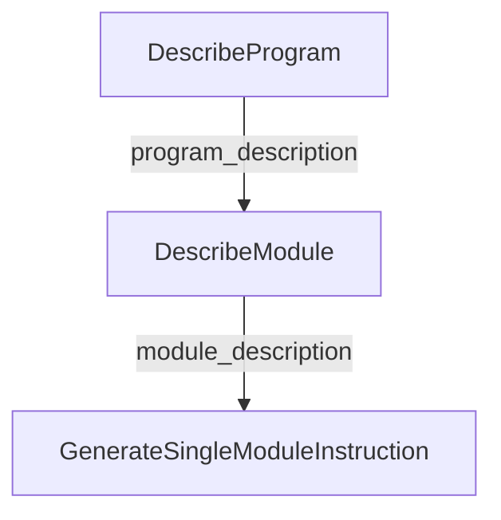

# program_context_and_initial_instructions
This module defines DSPy signatures for describing programs and modules, and for generating instructions for individual modules within a larger language model pipeline, focusing on understanding program structure and purpose.

<!-- DIAGRAM_JSON
{
    "nodes": [
        {
            "id": "DescribeProgram",
            "label": "DescribeProgram"
        },
        {
            "id": "DescribeModule",
            "label": "DescribeModule"
        },
        {
            "id": "GenerateSingleModuleInstruction",
            "label": "GenerateSingleModuleInstruction"
        }
    ],
    "edges": [
        {
            "source": "DescribeProgram",
            "target": "DescribeModule",
            "label": "program_description"
        },
        {
            "source": "DescribeModule",
            "target": "GenerateSingleModuleInstruction",
            "label": "module_description"
        }
    ],
    "groups": []
}
-->
