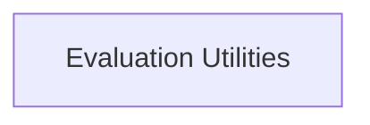

# Program Evaluation Module

The `program_evaluation` module, part of the `dspy.teleprompt.utils` package, provides essential utilities for assessing the quality and performance of candidate programs generated during the teleprompting process. It focuses on tracking the history of task models and calculating the improvement of proposed programs over iterations, aiding in the optimization and refinement of DSPy programs.

## Architecture

The `program_evaluation` module is composed of a single sub-module, `evaluation_utilities`, which centralizes the core logic for program assessment and historical tracking.

<!-- DIAGRAM_JSON
{
    "direction": "TD",
    "nodes": [
        {"id": "evaluation_utilities", "label": "Evaluation Utilities", "type": "module", "link": "evaluation_utilities.md"}
    ],
    "edges": [],
    "groups": []
}
-->

## Sub-modules

### [Evaluation Utilities](evaluation_utilities.md)
This sub-module provides critical functions for obtaining the full trace of a task model's history for a given candidate program and for calculating the average and best quality of the last `n` proposed programs. These utilities are vital for understanding program behavior and assessing the effectiveness of optimization strategies within DSPy's teleprompting framework.
