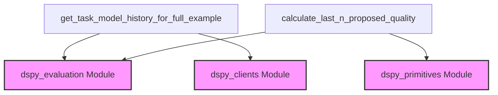

# program_evaluation_metrics

The `program_evaluation_metrics` module provides essential utilities for evaluating the performance and tracking the history of candidate programs, particularly within teleprompting and program optimization workflows. It offers functions to inspect the operational history of language models used in a program and to quantify the quality of recently proposed programs.

<!-- DIAGRAM_JSON
{
    "direction": "TD",
    "nodes": [
        {"id": "get_task_model_history_for_full_example", "label": "get_task_model_history_for_full_example", "type": "component", "link": null},
        {"id": "calculate_last_n_proposed_quality", "label": "calculate_last_n_proposed_quality", "type": "component", "link": null},
        {"id": "dspy_evaluation", "label": "dspy_evaluation Module", "type": "external", "link": "dspy_evaluation.md"},
        {"id": "dspy_primitives", "label": "dspy_primitives Module", "type": "external", "link": "dspy_primitives.md"},
        {"id": "dspy_clients", "label": "dspy_clients Module", "type": "external", "link": "dspy_clients.md"}
    ],
    "edges": [
        {"source": "get_task_model_history_for_full_example", "target": "dspy_evaluation"},
        {"source": "get_task_model_history_for_full_example", "target": "dspy_clients"},
        {"source": "calculate_last_n_proposed_quality", "target": "dspy_evaluation"},
        {"source": "calculate_last_n_proposed_quality", "target": "dspy_primitives"}
    ],
    "groups": []
}
-->

## Purpose and Core Functionality

The `program_evaluation_metrics` module plays a crucial role in the `dspy.teleprompt.utils.program_evaluation` sub-system by providing tools to assess and monitor the performance of generated or optimized programs. Its core functionalities include:

*   **Tracing Program Execution:** Capturing and inspecting the history of a `task_model`'s interactions for a given candidate program, which is vital for debugging and understanding program behavior.
*   **Quantifying Program Quality Over Time:** Calculating the average and best scores for a set of recently proposed programs, enabling tracking of improvement or degradation in program quality during iterative optimization processes.

## Architecture and Component Relationships

The module contains two primary functions, `get_task_model_history_for_full_example` and `calculate_last_n_proposed_quality`, which interact with external DSPy modules for their operations.

*   **`get_task_model_history_for_full_example`**: This function is responsible for retrieving the full execution trace of a `task_model` when evaluating a `candidate_program`. It depends on:
    *   **`dspy_evaluation`**: Utilizes an `evaluate` function from this module to run the candidate program on a small devset. (See [dspy_evaluation.md](dspy_evaluation.md))
    *   **`dspy_clients`**: Interacts with the `task_model` (typically a language model or similar client) to inspect its internal history. (See [dspy_clients.md](dspy_clients.md))

*   **`calculate_last_n_proposed_quality`**: This function assesses the quality of the 'n' most recently proposed programs based on their performance on both training and development datasets. It depends on:
    *   **`dspy_evaluation`**: Uses an `evaluate` function from this module to determine the performance score of programs on the development set. (See [dspy_evaluation.md](dspy_evaluation.md))
    *   **`dspy_primitives`**: Works with `base_program` which is an instance of `dspy.primitives.module.Module` for loading and evaluating different proposed programs. (See [dspy_primitives.md](dspy_primitives.md))

## How the Module Fits into the Overall System

The `program_evaluation_metrics` module is a fundamental part of the `dspy.teleprompting_optimizers` ecosystem, specifically nested under `dspy.teleprompt.utils.program_evaluation`. It provides the concrete metrics and historical tracing capabilities that teleprompting optimizers rely on to:

1.  **Iterate and Improve:** By calculating the quality of proposed programs, optimizers can make informed decisions about which programs to keep, modify, or discard.
2.  **Debug and Analyze:** The ability to inspect the `task_model`'s history helps developers understand why a program performs in a certain way, facilitating debugging and further refinement of prompts and program structures.

This module ensures that the iterative process of program generation and optimization within DSPy is data-driven and effectively monitored.