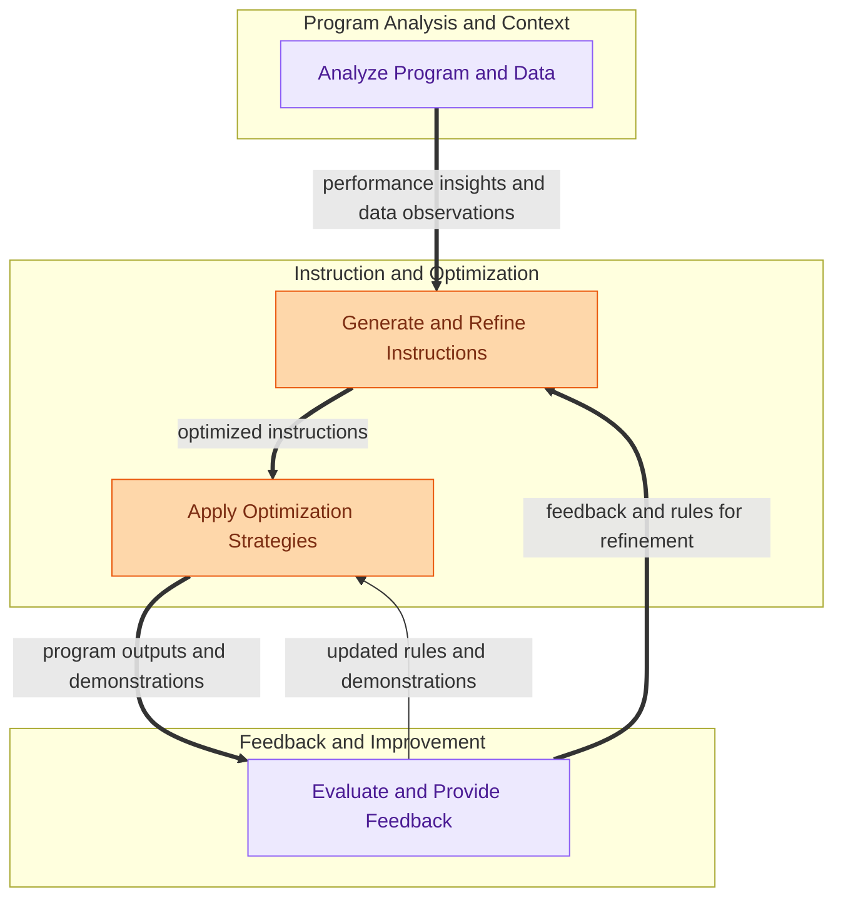

The `program_optimization` module is dedicated to enhancing the performance and efficiency of DSPy programs. It provides a comprehensive suite of teleprompters and utilities that automatically refine prompt instructions, manage few-shot demonstrations, and fine-tune language models. This allows users to iteratively improve their programs without manual prompt engineering, leading to more robust and accurate results.

### How it Works

The module orchestrates a continuous improvement loop for DSPy programs:

1.  **Analyze Program and Data**: Utilities gather insights from program execution traces and analyze datasets to identify areas for improvement.
2.  **Generate and Refine Instructions**: Based on these insights, initial instructions for language models are generated and then iteratively refined using feedback and prior attempts.
3.  **Apply Optimization Strategies**: Various teleprompters apply sophisticated strategies to evolve prompts, manage few-shot examples, and fine-tune models, aiming to improve program performance.
4.  **Evaluate and Provide Feedback**: A feedback mechanism evaluates the performance of the optimized programs and generates structured feedback, which then informs further instruction refinement or direct application of rules and demonstrations.

### Core Components

*   **Optimizers**: Contains various teleprompters like `MIPROv2`, `GEPA`, `COPRO`, `SIMBA`, and `BootstrapFewShotWithOptuna` for evolving prompts, managing few-shot demonstrations, and fine-tuning models.
    *   [Optimizers Documentation](optimizers.md)
*   **Instruction Generation**: Manages the creation and iterative refinement of instructions for language models, including `DescribeProgram`, `GenerateSingleModuleInstruction`, and `MultiModalInstructionProposer`.
    *   [Instruction Generation Documentation](instruction_generation.md)
*   **Feedback and Rules**: Provides mechanisms for defining feedback metrics (`GEPAFeedbackMetric`), comparing program performance (`Comparator`), and dynamically applying rules and demonstrations (`append_a_rule`, `OfferFeedback`).
    *   [Feedback and Rules Documentation](feedback_and_rules.md)
*   **Optimization Utilities**: Offers foundational tools for dataset analysis (`DatasetDescriptor`), program tracing (`patched_forward`), and logging performance metrics (`log_token_usage`).
    *   [Optimization Utilities Documentation](optimization_utilities.md)