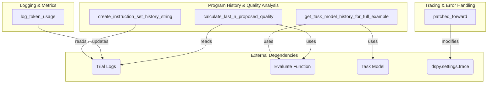

# program_tracing_and_logging
This module provides utilities for tracing program execution, logging token usage, and analyzing the history and quality of proposed programs during optimization processes.

<!-- DIAGRAM_JSON
{
    "nodes": [
        {
            "id": "A",
            "label": "create_instruction_set_history_string"
        },
        {
            "id": "B",
            "label": "patched_forward"
        },
        {
            "id": "C",
            "label": "get_task_model_history_for_full_example"
        },
        {
            "id": "D",
            "label": "log_token_usage"
        },
        {
            "id": "E",
            "label": "calculate_last_n_proposed_quality"
        },
        {
            "id": "F",
            "label": "Trial Logs"
        },
        {
            "id": "G",
            "label": "Evaluate Function"
        },
        {
            "id": "H",
            "label": "Task Model"
        },
        {
            "id": "I",
            "label": "dspy.settings.trace"
        }
    ],
    "edges": [
        {
            "source": "A",
            "target": "F",
            "label": "reads"
        },
        {
            "source": "B",
            "target": "I",
            "label": "modifies"
        },
        {
            "source": "C",
            "target": "G",
            "label": "uses"
        },
        {
            "source": "C",
            "target": "H",
            "label": "uses"
        },
        {
            "source": "D",
            "target": "F",
            "label": "updates"
        },
        {
            "source": "E",
            "target": "F",
            "label": "reads"
        },
        {
            "source": "E",
            "target": "G",
            "label": "uses"
        }
    ],
    "groups": [
        {
            "id": "tracing_error_handling",
            "label": "Tracing & Error Handling",
            "nodes": [
                "B"
            ]
        },
        {
            "id": "logging_metrics",
            "label": "Logging & Metrics",
            "nodes": [
                "D"
            ]
        },
        {
            "id": "program_history_quality_analysis",
            "label": "Program History & Quality Analysis",
            "nodes": [
                "A",
                "C",
                "E"
            ]
        }
    ]
}
-->
