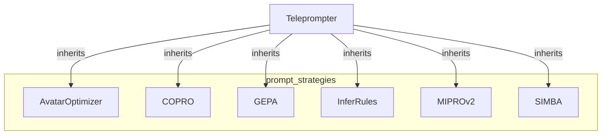

# prompt_strategies
This module provides various advanced teleprompter and optimizer strategies for DSPy, including evolutionary, rule-induction, and introspective methods to enhance program performance.

<!-- DIAGRAM_JSON
{
  "nodes": [
    {"id": "prompt_strategies", "label": "prompt_strategies", "type": "module"},
    {"id": "AvatarOptimizer", "label": "AvatarOptimizer", "type": "class"},
    {"id": "COPRO", "label": "COPRO", "type": "class"},
    {"id": "GEPA", "label": "GEPA", "type": "class"},
    {"id": "InferRules", "label": "InferRules", "type": "class"},
    {"id": "MIPROv2", "label": "MIPROv2", "type": "class"},
    {"id": "SIMBA", "label": "SIMBA", "type": "class"},
    {"id": "Teleprompter", "label": "Teleprompter", "type": "class"}
  ],
  "edges": [
    {"source": "Teleprompter", "target": "AvatarOptimizer", "type": "inherits"},
    {"source": "Teleprompter", "target": "COPRO", "type": "inherits"},
    {"source": "Teleprompter", "target": "GEPA", "type": "inherits"},
    {"source": "Teleprompter", "target": "InferRules", "type": "inherits"},
    {"source": "Teleprompter", "target": "MIPROv2", "type": "inherits"},
    {"source": "Teleprompter", "target": "SIMBA", "type": "inherits"}
  ],
  "groups": [
    {"id": "prompt_strategies", "label": "prompt_strategies", "type": "module", "contains": ["AvatarOptimizer", "COPRO", "GEPA", "InferRules", "MIPROv2", "SIMBA"]}
  ]
}
-->
