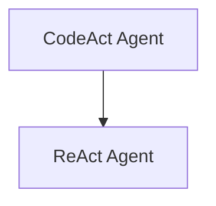

# React Based Agents

The `react_based_agents` module provides powerful agents that combine reasoning and acting capabilities to solve complex tasks. It includes implementations of the CodeAct and ReAct paradigms, enabling models to interact with tools, execute code, and iteratively refine their approach to achieve a goal.

## Architecture Overview

The module is structured into two main sub-modules:

<!-- DIAGRAM_JSON
{
    "direction": "TD",
    "nodes": [
        {"id": "code_act_agent", "label": "CodeAct Agent", "type": "module", "link": "code_act_agent.md"},
        {"id": "react_agent", "label": "ReAct Agent", "type": "module", "link": "react_agent.md"}
    ],
    "edges": [
        {"source": "code_act_agent", "target": "react_agent"}
    ],
    "groups": []
}
-->

## Sub-modules

### [CodeAct Agent](code_act_agent.md)
This sub-module focuses on the CodeAct paradigm, where agents generate and execute Python code using an interpreter and a set of predefined tools to solve problems.

### [ReAct Agent](react_agent.md)
This sub-module implements the Reasoning and Acting (ReAct) framework, allowing agents to interleave thoughts and tool actions to gather information and complete tasks iteratively.
