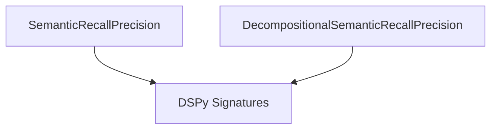

# `recall_precision_signatures` Module Documentation

## Introduction

This module defines DSPy Signatures specifically designed for evaluating the semantic recall and precision of language model responses. It offers two distinct approaches: a direct comparison method and a more granular, decompositional method that first enumerates key ideas before calculating metrics.

## Purpose and Core Functionality

The `recall_precision_signatures` module provides the foundational signatures for automatically assessing the quality of generative AI outputs in terms of how well they semantically align with a given ground truth.

### Core Components

#### `SemanticRecallPrecision`

```python
class SemanticRecallPrecision(Signature):
    """
    Compare a system's response to the ground truth to compute its recall and precision.
    If asked to reason, enumerate key ideas in each response, and whether they are present in the other response.
    """

    question: str = InputField()
    ground_truth: str = InputField()
    system_response: str = InputField()
    recall: float = OutputField(desc="fraction (out of 1.0) of ground truth covered by the system response")
    precision: float = OutputField(desc="fraction (out of 1.0) of system response covered by the ground truth")
```

This signature directly computes the semantic recall and precision of a `system_response` against a `ground_truth` for a given `question`. Recall indicates the fraction of ideas in the ground truth covered by the system response, while precision indicates the fraction of ideas in the system response that are relevant to the ground truth.

#### `DecompositionalSemanticRecallPrecision`

```python
class DecompositionalSemanticRecallPrecision(Signature):
    """
    Compare a system's response to the ground truth to compute recall and precision of key ideas.
    You will first enumerate key ideas in each response, discuss their overlap, and then report recall and precision.
    """

    question: str = InputField()
    ground_truth: str = InputField()
    system_response: str = InputField()
    ground_truth_key_ideas: str = OutputField(desc="enumeration of key ideas in the ground truth")
    system_response_key_ideas: str = OutputField(desc="enumeration of key ideas in the system response")
    discussion: str = OutputField(desc="discussion of the overlap between ground truth and system response")
    recall: float = OutputField(desc="fraction (out of 1.0) of ground truth covered by the system response")
    precision: float = OutputField(desc="fraction (out of 1.0) of system response covered by the ground truth")
```

This signature provides a more detailed, step-by-step evaluation. It first extracts `ground_truth_key_ideas` and `system_response_key_ideas`, then provides a `discussion` of their overlap, and finally computes the `recall` and `precision` based on these enumerated ideas.

## Architecture and Component Relationships

The `recall_precision_signatures` module consists of two primary DSPy `Signature` components: `SemanticRecallPrecision` and `DecompositionalSemanticRecallPrecision`. Both signatures inherit from the base `Signature` class provided by the [dspy_signatures.md](dspy_signatures.md) module, establishing their role as structured prompts or tasks within DSPy programs.

`DecompositionalSemanticRecallPrecision` offers a more intricate evaluation process compared to the direct approach of `SemanticRecallPrecision`, by introducing intermediate steps for key idea extraction and discussion, which can be particularly useful for debugging and understanding the reasoning behind the scores.

<!-- DIAGRAM_JSON
{
    "direction": "TD",
    "nodes": [
        {"id": "semantic_recall_precision", "label": "SemanticRecallPrecision", "type": "component", "link": null},
        {"id": "decompositional_semantic_recall_precision", "label": "DecompositionalSemanticRecallPrecision", "type": "component", "link": null},
        {"id": "dspy_signatures", "label": "DSPy Signatures", "type": "external", "link": "dspy_signatures.md"}
    ],
    "edges": [
        {"source": "semantic_recall_precision", "target": "dspy_signatures"},
        {"source": "decompositional_semantic_recall_precision", "target": "dspy_signatures"}
    ],
    "groups": []
}
-->



## How the Module Fits into the Overall System

The `recall_precision_signatures` module is an essential part of the DSPy [dspy_evaluation.md](dspy_evaluation.md) framework, specifically nested within the [auto_metrics.md](auto_metrics.md) and [semantic_metrics.md](semantic_metrics.md) sub-modules. These signatures are designed to be integrated with DSPy's automatic evaluation capabilities, enabling the programmatic assessment of language model outputs based on their semantic content. They provide a robust mechanism for measuring how comprehensively a system's response addresses the ground truth (recall) and how accurate and relevant its own content is to the ground truth (precision).

This functionality is crucial for developing and refining robust language models, as it moves beyond simple keyword matching to evaluate the deeper conceptual understanding and generation quality. The decompositional approach further aids in transparency and interpretability of the evaluation process, making it valuable for model developers and evaluators alike.