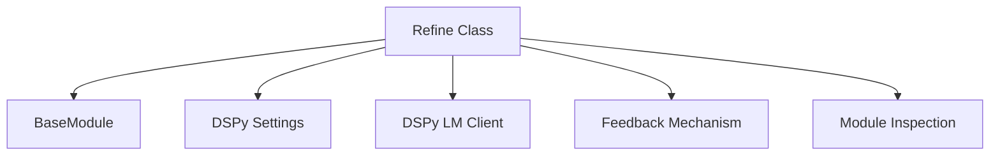

# Refinement Core Module

The `refinement_core` module provides the core logic for the `Refine` prediction strategy in DSPy. This strategy is designed to improve the performance of a given DSPy module by iteratively running it, evaluating its outputs, and generating feedback to guide subsequent attempts.

## Architecture and Component Relationships

The `refinement_core` module primarily consists of the `Refine` class, which orchestrates the refinement process. It interacts with several other DSPy modules to achieve its functionality, including those for basic module definitions, DSPy settings, language model clients, feedback generation, and module inspection.

<!-- DIAGRAM_JSON
{
    "direction": "TD",
    "nodes": [
        {"id": "refine_class", "label": "Refine Class", "type": "component", "link": null},
        {"id": "module_base", "label": "BaseModule", "type": "external", "link": "dspy_primitives.md"},
        {"id": "dspy_settings", "label": "DSPy Settings", "type": "external", "link": "dspy_dsp_utilities.md"},
        {"id": "dspy_clients_lm", "label": "DSPy LM Client", "type": "external", "link": "dspy_clients.md"},
        {"id": "feedback_mechanism", "label": "Feedback Mechanism", "type": "external", "link": "feedback_mechanism.md"},
        {"id": "module_inspection", "label": "Module Inspection", "type": "external", "link": "module_inspection.md"}
    ],
    "edges": [
        {"source": "refine_class", "target": "module_base"},
        {"source": "refine_class", "target": "dspy_settings"},
        {"source": "refine_class", "target": "dspy_clients_lm"},
        {"source": "refine_class", "target": "feedback_mechanism"},
        {"source": "refine_class", "target": "module_inspection"}
    ],
    "groups": []
}
-->



## Core Components

### Refine

`Refine` is a DSPy module that attempts to improve the output of another module by repeatedly running it, evaluating the results with a `reward_fn`, and if necessary, generating feedback to guide subsequent attempts. This process continues for a specified number of trials (`N`) or until a satisfactory reward `threshold` is met.

**Purpose:**

To enhance the reliability and quality of a DSPy module's predictions by introducing an iterative refinement loop. It's particularly useful for tasks where initial outputs might be suboptimal and can benefit from guided self-correction.

**Usage:**

Initialize `Refine` with the module to be refined, the number of attempts (`N`), a `reward_fn` to evaluate outputs, and a `threshold` for acceptable performance. The `reward_fn` is crucial as it determines what constitutes a "good" prediction.

```python
class Refine(Module):
    def __init__(
        self,
        module: Module,
        N: int,  # noqa: N803
        reward_fn: Callable[[dict, Prediction], float],
        threshold: float,
        fail_count: int | None = None,
    ):
        """
        Refines a module by running it up to N times with different rollout IDs at `temperature=1.0`
        and returns the best prediction.

        This module runs the provided module multiple times with varying rollout identifiers and selects
        either the first prediction that exceeds the specified threshold or the one with the highest reward.
        If no prediction meets the threshold, it automatically generates feedback to improve future predictions.


        Args:
            module (Module): The module to refine.
            N (int): The number of times to run the module. must
            reward_fn (Callable): The reward function.
            threshold (float): The threshold for the reward function.
            fail_count (Optional[int], optional): The number of times the module can fail before raising an error

        Examples:
            ```python
            import dspy

            dspy.configure(lm=dspy.LM("openai/gpt-4o-mini"))

            # Define a QA module with chain of thought
            qa = dspy.ChainOfThought("question -> answer")

            # Define a reward function that checks for one-word answers
            def one_word_answer(args, pred):
                return 1.0 if len(pred.answer.split()) == 1 else 0.0

            # Create a refined module that tries up to 3 times
            best_of_3 = dspy.Refine(module=qa, N=3, reward_fn=one_word_answer, threshold=1.0)

            # Use the refined module
            result = best_of_3(question="What is the capital of Belgium?").answer
            # Returns: Brussels
            ```
        """
        self.module = module
        self.reward_fn = lambda *args: reward_fn(*args)  # to prevent this from becoming a parameter
        self.threshold = threshold
        self.N = N
        self.fail_count = fail_count or N  # default to N if fail_count is not provided
        self.module_code = inspect.getsource(module.__class__)
        try:
            self.reward_fn_code = inspect.getsource(reward_fn)
        except TypeError:
            self.reward_fn_code = inspect.getsource(reward_fn.__class__)

    def forward(self, **kwargs):
        lm = self.module.get_lm() or dspy.settings.lm
        start = lm.kwargs.get("rollout_id", 0)
        rollout_ids = [start + i for i in range(self.N)]
        best_pred, best_trace, best_reward = None, None, -float("inf")
        advice = None
        adapter = dspy.settings.adapter or dspy.ChatAdapter()

        for idx, rid in enumerate(rollout_ids):
            lm_ = lm.copy(rollout_id=rid, temperature=1.0)
            mod = self.module.deepcopy()
            mod.set_lm(lm_)

            predictor2name = {predictor: name for name, predictor in mod.named_predictors()}
            signature2name = {predictor.signature: name for name, predictor in mod.named_predictors()}
            module_names = [name for name, _ in mod.named_predictors()]

            try:
                with dspy.context(trace=[]):
                    if not advice:
                        outputs = mod(**kwargs)
                    else:

                        class WrapperAdapter(adapter.__class__):
                            def __call__(self, lm, lm_kwargs, signature, demos, inputs):
                                inputs["hint_"] = advice.get(signature2name[signature], "N/A")  # noqa: B023
                                signature = signature.append(
                                    "hint_", InputField(desc="A hint to the module from an earlier run")
                                )
                                return adapter(lm, lm_kwargs, signature, demos, inputs)

                        with dspy.context(adapter=WrapperAdapter()):
                            outputs = mod(**kwargs)

                    trace = dspy.settings.trace.copy()

                    # TODO: Remove the hint from the trace, if it's there.

                    # NOTE: Not including the trace of reward_fn.
                    reward = self.reward_fn(kwargs, outputs)

                if reward > best_reward:
                    best_reward, best_pred, best_trace = reward, outputs, trace

                if self.threshold is not None and reward >= self.threshold:
                    break

                if idx == self.N - 1:
                    break

                modules = {"program_code": self.module_code, "modules_defn": inspect_modules(mod)}
                trajectory = [{"module_name": predictor2name[p], "inputs": i, "outputs": dict(o)} for p, i, o in trace]
                trajectory = {
                    "program_inputs": kwargs,
                    "program_trajectory": trajectory,
                    "program_outputs": dict(outputs),
                }
                reward = {
                    "reward_code": self.reward_fn_code,
                    "target_threshold": self.threshold,
                    "reward_value": reward,
                }

                advise_kwargs = dict(**modules, **trajectory, **reward, module_names=module_names)
                # only dumps if it's a list or dict
                advise_kwargs = {
                    k: v if isinstance(v, str) else orjson.dumps(recursive_mask(v), option=orjson.OPT_INDENT_2).decode()
                    for k, v in advise_kwargs.items()
                }
                advice = dspy.Predict(OfferFeedback)(**advise_kwargs).advice
                # print(f"Advice for each module: {advice}")

            except Exception as e:
                print(f"Refine: Attempt failed with rollout id {rid}: {e}")
                if idx > self.fail_count:
                    raise e
                self.fail_count -= 1
        if best_trace:
            dspy.settings.trace.extend(best_trace)
        return best_pred
```
