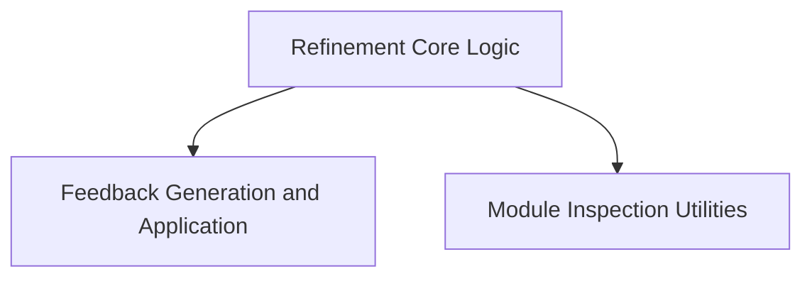

# Refinement Strategy Module

The `refinement_strategy` module in DSPy provides mechanisms for iteratively improving the performance of a language model program. It achieves this by running a given module multiple times, evaluating its outputs against a defined reward function, and generating actionable feedback to guide subsequent attempts. This iterative process aims to help modules converge towards desired output characteristics.

## Architecture Overview

The `refinement_strategy` module is composed of three interconnected sub-modules: `refinement_core`, `feedback_mechanism`, and `module_inspection`. The `refinement_core` acts as the orchestrator, managing the overall refinement loop. It leverages the `feedback_mechanism` to formulate and apply corrective advice based on prior execution outcomes, and it utilizes `module_inspection` utilities to gain insights into the structure and behavior of the modules being refined.

<!-- DIAGRAM_JSON
{
    "direction": "TD",
    "nodes": [
        {"id": "refinement_core", "label": "Refinement Core Logic", "type": "module", "link": "refinement_core.md"},
        {"id": "feedback_mechanism", "label": "Feedback Generation and Application", "type": "module", "link": "feedback_mechanism.md"},
        {"id": "module_inspection", "label": "Module Inspection Utilities", "type": "module", "link": "module_inspection.md"}
    ],
    "edges": [
        {"source": "refinement_core", "target": "feedback_mechanism"},
        {"source": "refinement_core", "target": "module_inspection"}
    ],
    "groups": []
}
-->

## Sub-modules

### [Refinement Core Logic](refinement_core.md)
This sub-module contains the central `Refine` class, which manages the iterative execution of a DSPy module, evaluates its outputs using a specified reward function, and determines whether further refinement or feedback is needed.

### [Feedback Generation and Application](feedback_mechanism.md)
This sub-module is responsible for defining how feedback is structured and generated (`OfferFeedback` signature) and how this feedback is then injected back into the module's execution (`WrapperAdapter`).

### [Module Inspection Utilities](module_inspection.md)
This sub-module provides helper functions like `inspect_modules` to deeply introspect the structure, input/output fields, and instructions of individual DSPy modules, aiding in the feedback generation process.