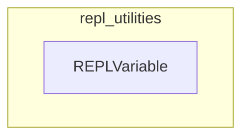

# repl_utilities
This module defines `REPLVariable`, a Pydantic model for encapsulating and formatting metadata about variables available in a REPL environment, including their name, type, description, and a preview.

<!-- DIAGRAM_JSON
{
  "nodes": [
    {
      "id": "REPLVariable",
      "label": "REPLVariable",
      "type": "class"
    }
  ],
  "edges": [],
  "groups": [
    {
      "id": "repl_utilities",
      "label": "repl_utilities",
      "nodes": [
        "REPLVariable"
      ]
    }
  ]
}
-->
