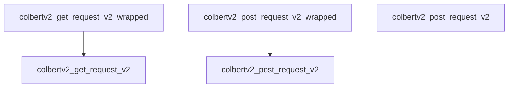

# Request Wrappers Module

## Introduction

The `request_wrappers` module, part of `dspy.dsp.colbertv2.api_integration`, provides simplified wrapper functions for interacting with the ColBERTv2 API. Its primary purpose is to abstract the direct HTTP request mechanisms for GET and POST operations, offering a consistent and potentially extensible interface for making calls to the ColBERTv2 service. This module ensures that other parts of the system can communicate with the ColBERTv2 API without needing to manage the low-level request details.

## Architecture and Component Relationships

The `request_wrappers` module is a small, focused component within the `dspy_dsp_utilities` ecosystem. It contains two core wrapper functions that delegate their calls to underlying ColBERTv2 request functions, which are likely defined within the [colbertv2_client](colbertv2_client.md) module or its direct parent.

### Core Components

*   **`colbertv2_get_request_v2_wrapped`**: A wrapper function that calls the `colbertv2_get_request_v2` function. It standardizes GET requests to the ColBERTv2 API.
*   **`colbertv2_post_request_v2_wrapped`**: A wrapper function that calls the `colbertv2_post_request_v2` function. It standardizes POST requests to the ColBERTv2 API.

These wrappers act as a stable interface, decoupling the consuming code from direct dependencies on the specific `colbertv2_get_request_v2` and `colbertv2_post_request_v2` implementations. This design allows for easier maintenance, potential request logging, or modification of request parameters in a centralized manner.

## System Integration

This module is a leaf component within the `dspy_dsp_utilities.colbert_retrieval.api_integration` sub-module. It plays a crucial role in the ColBERTv2 integration by providing the direct means of communication with the external ColBERTv2 service. Modules that require fetching or sending data to the ColBERTv2 API will utilize these wrapper functions, ensuring a standardized and managed interaction layer. It serves as a foundational layer for the [colbertv2_client](colbertv2_client.md) and other components that interact with the ColBERTv2 backend.

<!-- DIAGRAM_JSON
{
    "direction": "TD",
    "nodes": [
        {"id": "get_wrapper", "label": "colbertv2_get_request_v2_wrapped", "type": "component", "link": null},
        {"id": "post_wrapper", "label": "colbertv2_post_request_v2_wrapped", "type": "component", "link": null},
        {"id": "colbertv2_get_req", "label": "colbertv2_get_request_v2", "type": "external", "link": "colbertv2_client.md"},
        {"id": "colbertv2_post_req", "label": "colbertv2_post_request_v2", "type": "external", "link": "colbertv2_client.md"}
    ],
    "edges": [
        {"source": "get_wrapper", "target": "colbertv2_get_req"},
        {"source": "post_wrapper", "target": "colbertv2_post_req"}
    ],
    "groups": []
}
-->

