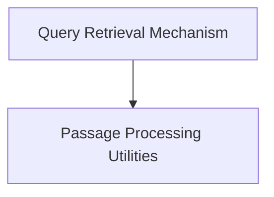

# Retrieval Logic Module

The `retrieval_logic` module is a fundamental component within the dspy.retrievers package, dedicated to orchestrating the core mechanisms of information retrieval. It provides the foundational classes and functions necessary to fetch relevant passages from a corpus based on a given query, acting as the interface to the underlying Retrieval Model (RM).

## Architecture Overview

The module is structured into key sub-modules that handle distinct aspects of the retrieval process:

<!-- DIAGRAM_JSON
{
    "direction": "TD",
    "nodes": [
        {"id": "query_retrieval", "label": "Query Retrieval Mechanism", "type": "module", "link": "query_retrieval.md"},
        {"id": "passage_processing", "label": "Passage Processing Utilities", "type": "module", "link": "passage_processing.md"}
    ],
    "edges": [
        {"source": "query_retrieval", "target": "passage_processing"}
    ],
    "groups": []
}
-->

## Sub-modules

### [Query Retrieval Mechanism](query_retrieval.md)
This sub-module encapsulates the primary logic for executing search queries against a configured Retrieval Model (RM). It is responsible for taking a user query and returning a list of raw, potentially relevant passages from a document corpus.

### [Passage Processing Utilities](passage_processing.md)
This sub-module focuses on refining and structuring the raw passages returned by the retrieval mechanism. It includes utilities for transforming the format of retrieved documents into a standardized `Prediction` object, making them ready for further processing or consumption by other dspy components.
