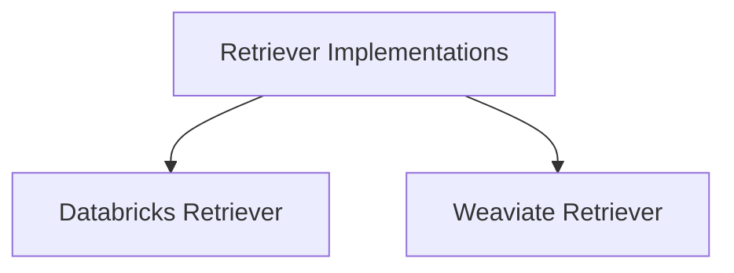

# Retriever Implementations

The `retriever_implementations` module provides concrete implementations for retrieving information from various vector databases and search indexes. It serves as a bridge between DSPy's retrieval abstraction and specific database technologies, allowing DSPy programs to interact with external knowledge sources.

## Architecture Overview

The `retriever_implementations` module is designed with a clear separation of concerns, where each sub-module handles the specifics of integrating with a particular retrieval system. This modular architecture facilitates the easy addition of new retriever backends and promotes maintainability.

<!-- DIAGRAM_JSON
{
    "direction": "TD",
    "nodes": [
        {"id": "ri", "label": "Retriever Implementations", "type": "module"},
        {"id": "databricks_retriever", "label": "Databricks Retriever", "type": "module", "link": "databricks_retriever.md"},
        {"id": "weaviate_retriever", "label": "Weaviate Retriever", "type": "module", "link": "weaviate_retriever.md"}
    ],
    "edges": [
        {"source": "ri", "target": "databricks_retriever"},
        {"source": "ri", "target": "weaviate_retriever"}
    ],
    "groups": []
}
-->

## Sub-modules

### [Databricks Retriever](databricks_retriever.md)
This sub-module encapsulates the functionality for connecting to and querying a Databricks Mosaic AI Vector Search Index. It enables DSPy programs to leverage Databricks for efficient and scalable document retrieval.

### [Weaviate Retriever](weaviate_retriever.md)
This sub-module provides the necessary logic for integrating with Weaviate, a cloud-native vector database. It allows DSPy applications to perform semantic searches and retrieve relevant passages from Weaviate collections.