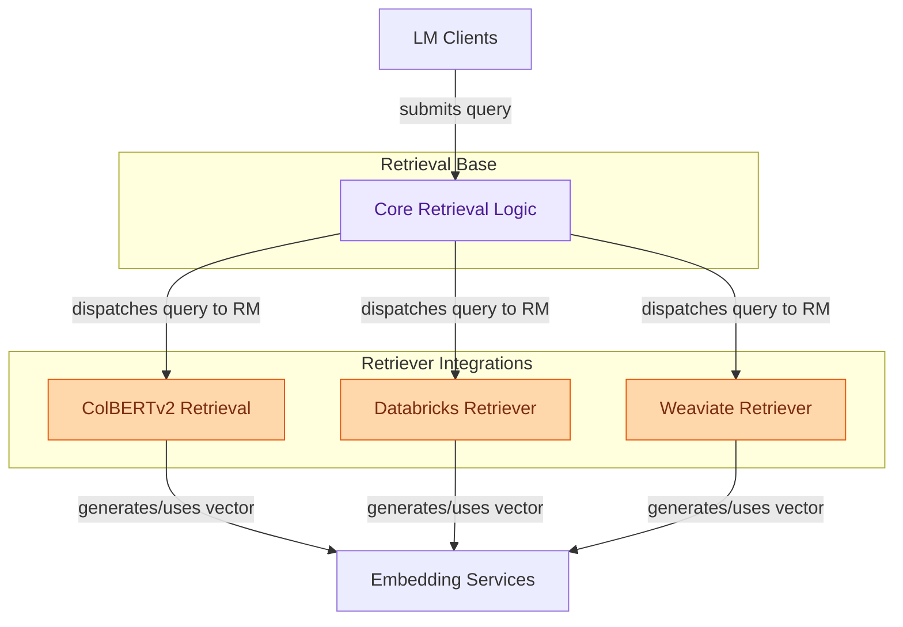

# Retrievers Module
This module provides various retrieval mechanisms, including a core retrieval interface, specialized integrations with ColBERTv2, Databricks Vector Search, and Weaviate, enabling efficient document fetching for language models.

<!-- DIAGRAM_JSON
{
    "direction": "TD",
    "nodes": [
        {
            "id": "retrievers",
            "label": "Retrievers",
            "type": "module"
        },
        {
            "id": "core_retrieval_mechanics",
            "label": "Core Retrieval Logic",
            "type": "module",
            "link": "core_retrieval_mechanics.md"
        },
        {
            "id": "colbertv2_integration",
            "label": "ColBERTv2 Retrieval",
            "type": "module",
            "link": "colbertv2_integration.md"
        },
        {
            "id": "databricks_vector_search",
            "label": "Databricks Retriever",
            "type": "module",
            "link": "databricks_vector_search.md"
        },
        {
            "id": "weaviate_vector_search",
            "label": "Weaviate Retriever",
            "type": "module",
            "link": "weaviate_vector_search.md"
        },
        {
            "id": "lm_clients",
            "label": "LM Clients",
            "type": "external",
            "link": "lm_clients.md"
        },
        {
            "id": "embedding_services",
            "label": "Embedding Services",
            "type": "external",
            "link": "embedding_services.md"
        }
    ],
    "edges": [
        {
            "source": "lm_clients",
            "target": "core_retrieval_mechanics",
            "label": "submits query"
        },
        {
            "source": "core_retrieval_mechanics",
            "target": "colbertv2_integration",
            "label": "dispatches query to RM"
        },
        {
            "source": "core_retrieval_mechanics",
            "target": "databricks_vector_search",
            "label": "dispatches query to RM"
        },
        {
            "source": "core_retrieval_mechanics",
            "target": "weaviate_vector_search",
            "label": "dispatches query to RM"
        },
        {
            "source": "colbertv2_integration",
            "target": "embedding_services",
            "label": "generates/uses vector"
        },
        {
            "source": "databricks_vector_search",
            "target": "embedding_services",
            "label": "generates/uses vector"
        },
        {
            "source": "weaviate_vector_search",
            "target": "embedding_services",
            "label": "generates/uses vector"
        }
    ],
    "groups": [
        {
            "id": "retrieval_base",
            "label": "Retrieval Base",
            "role": "analytical",
            "nodes": [
                "core_retrieval_mechanics"
            ]
        },
        {
            "id": "retriever_integrations",
            "label": "Retriever Integrations",
            "role": "generative",
            "nodes": [
                "colbertv2_integration",
                "databricks_vector_search",
                "weaviate_vector_search"
            ]
        }
    ]
}
-->

