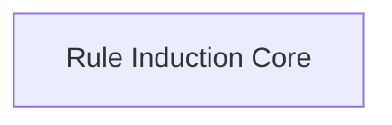

# Rule Induction Logic Module

## Introduction
The `rule_induction_logic` module, found within `dspy.teleprompt.infer_rules`, is responsible for inducing natural language rules from a given set of examples. It extends the `BootstrapFewShot` teleprompting strategy to iteratively refine program instructions by incorporating learned rules, aiming to improve the overall performance of the DSPy program.

## Architecture Overview
The `rule_induction_logic` module primarily consists of two core components: `InferRules` and `CustomRulesInduction`. The `InferRules` class orchestrates the rule induction process, managing candidate programs, evaluating their performance, and updating their instructions. The `CustomRulesInduction` signature defines the structure for extracting rules from examples using a language model.

<!-- DIAGRAM_JSON
{
    "direction": "TD",
    "nodes": [
        {"id": "rule_induction_core", "label": "Rule Induction Core", "type": "module", "link": "rule_induction_core.md"}
    ],
    "edges": [],
    "groups": []
}
-->

## Sub-modules

*   **Rule Induction Core** ([`rule_induction_core.md`](rule_induction_core.md)): This sub-module contains the main logic for inducing natural language rules from examples and defining the signature for rule extraction. It includes the `InferRules` class, which manages the rule induction process, and the `CustomRulesInduction` signature, which formalizes the rule extraction task.
