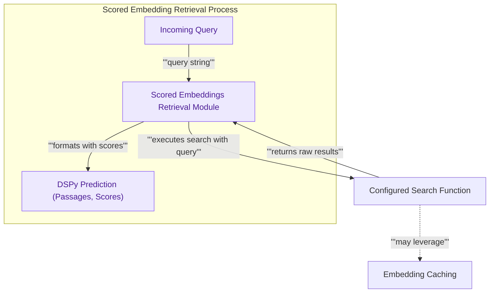

# Scored Embeddings Retrieval
This module enhances embedding-based retrieval by providing similarity scores alongside the retrieved passages and their original indices, enabling more nuanced downstream processing like thresholding or re-ranking.

<!-- DIAGRAM_JSON
{
    "direction": "TD",
    "nodes": [
        {"id": "incoming_query", "label": "Incoming Query", "type": "component", "link": null},
        {"id": "scored_retrieval", "label": "Scored Embeddings Retrieval Module", "type": "component", "link": null},
        {"id": "configured_search_fn", "label": "Configured Search Function", "type": "external", "link": null},
        {"id": "embedding_caching", "label": "Embedding Caching", "type": "external", "link": "embedding_caching.md"},
        {"id": "dspy_prediction", "label": "DSPy Prediction (Passages, Scores)", "type": "component", "link": null}
    ],
    "edges": [
        {"source": "incoming_query", "target": "scored_retrieval", "label": "query string"},
        {"source": "scored_retrieval", "target": "configured_search_fn", "label": "executes search with query"},
        {"source": "configured_search_fn", "target": "scored_retrieval", "label": "returns raw results"},
        {"source": "configured_search_fn", "target": "embedding_caching", "label": "may leverage"},
        {"source": "scored_retrieval", "target": "dspy_prediction", "label": "formats with scores"}
    ],
    "groups": [
        {"id": "retrieval_flow", "label": "Scored Embedding Retrieval Process", "role": "analytical", "nodes": ["incoming_query", "scored_retrieval", "dspy_prediction"]}
    ]
}
-->

