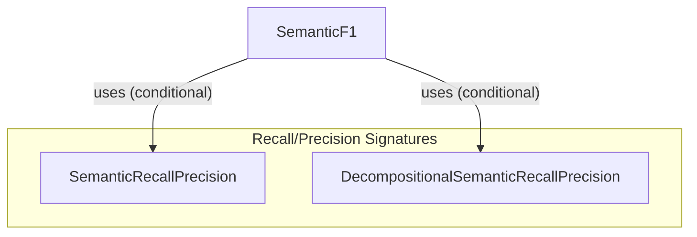

# semantic_f1_evaluation
This module provides components for computing semantic F1 scores between a prediction and ground truth, utilizing LLM-based precision and recall, with an option for decompositional analysis.

<!-- DIAGRAM_JSON
{
  "nodes": [
    {
      "id": "SemanticF1",
      "label": "SemanticF1",
      "type": "class"
    },
    {
      "id": "SemanticRecallPrecision",
      "label": "SemanticRecallPrecision",
      "type": "class"
    },
    {
      "id": "DecompositionalSemanticRecallPrecision",
      "label": "DecompositionalSemanticRecallPrecision",
      "type": "class"
    }
  ],
  "edges": [
    {
      "source": "SemanticF1",
      "target": "SemanticRecallPrecision",
      "label": "uses (conditional)"
    },
    {
      "source": "SemanticF1",
      "target": "DecompositionalSemanticRecallPrecision",
      "label": "uses (conditional)"
    }
  ],
  "groups": [
    {
      "id": "recall_precision_signatures",
      "label": "Recall/Precision Signatures",
      "nodes": ["SemanticRecallPrecision", "DecompositionalSemanticRecallPrecision"]
    }
  ]
}
-->
