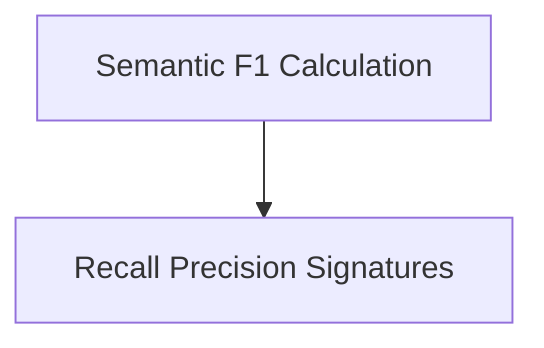

# Semantic Metrics Module

## Introduction
The `semantic_metrics` module provides advanced, LLM-based metrics for evaluating the semantic quality of system responses against ground truth. It focuses on calculating semantic F1, recall, and precision, offering both direct and decompositional approaches to assess the completeness and accuracy of generated text.

## Architecture Overview
This module is composed of core components responsible for defining the evaluation signatures and orchestrating the calculation of semantic F1 scores. It integrates with the broader `dspy.evaluate.auto_evaluation` system to enable automated and nuanced assessment of language model outputs.

<!-- DIAGRAM_JSON
{
    "direction": "TD",
    "nodes": [
        {"id": "semantic_f1_calculation", "label": "Semantic F1 Calculation", "type": "module", "link": "semantic_f1_calculation.md"},
        {"id": "recall_precision_signatures", "label": "Recall Precision Signatures", "type": "module", "link": "recall_precision_signatures.md"}
    ],
    "edges": [
        {"source": "semantic_f1_calculation", "target": "recall_precision_signatures"}
    ],
    "groups": []
}
-->

## Sub-modules

### [Semantic F1 Calculation](semantic_f1_calculation.md)
This sub-module is responsible for computing the overall semantic F1 score. It leverages underlying recall and precision mechanisms to provide a single, comprehensive metric for evaluating the semantic similarity between predicted and ground truth responses.

### [Recall Precision Signatures](recall_precision_signatures.md)
This sub-module defines the LLM signatures used for calculating semantic recall and precision. It includes both a direct approach and a decompositional approach, which first enumerates key ideas before assessing overlap, offering more granular insights into semantic correspondence.
