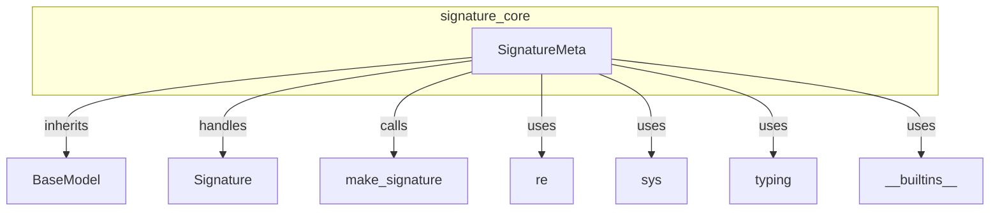

# signature_core
The `signature_core` module defines `SignatureMeta`, a metaclass that customizes the creation of `Signature` objects. It dynamically detects and resolves custom types from the caller's frame to facilitate flexible signature definition.

<!-- DIAGRAM_JSON
{
    "nodes": [
        {
            "id": "signature_core",
            "label": "signature_core",
            "type": "module"
        },
        {
            "id": "SignatureMeta",
            "label": "SignatureMeta",
            "type": "class"
        },
        {
            "id": "BaseModel",
            "label": "BaseModel",
            "type": "class",
            "is_external": true
        },
        {
            "id": "Signature",
            "label": "Signature",
            "type": "class",
            "is_external": true
        },
        {
            "id": "make_signature",
            "label": "make_signature",
            "type": "function",
            "is_external": true
        },
        {
            "id": "re",
            "label": "re",
            "type": "module",
            "is_external": true
        },
        {
            "id": "sys",
            "label": "sys",
            "type": "module",
            "is_external": true
        },
        {
            "id": "typing",
            "label": "typing",
            "type": "module",
            "is_external": true
        },
        {
            "id": "__builtins__",
            "label": "__builtins__",
            "type": "builtin",
            "is_external": true
        }
    ],
    "edges": [
        {
            "source": "signature_core",
            "target": "SignatureMeta",
            "type": "contains"
        },
        {
            "source": "SignatureMeta",
            "target": "BaseModel",
            "type": "inherits_from"
        },
        {
            "source": "SignatureMeta",
            "target": "Signature",
            "type": "handles"
        },
        {
            "source": "SignatureMeta",
            "target": "make_signature",
            "type": "calls"
        },
        {
            "source": "SignatureMeta",
            "target": "re",
            "type": "uses"
        },
        {
            "source": "SignatureMeta",
            "target": "sys",
            "type": "uses"
        },
        {
            "source": "SignatureMeta",
            "target": "typing",
            "type": "uses"
        },
        {
            "source": "SignatureMeta",
            "target": "__builtins__",
            "type": "uses"
        }
    ],
    "groups": [
        {
            "id": "signature_core_group",
            "label": "signature_core",
            "nodes": [
                "SignatureMeta"
            ]
        }
    ]
}
-->
