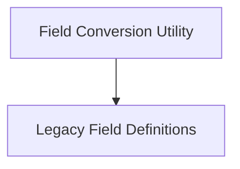

# Signature Fields Module

The `signature_fields` module in DSPy is responsible for managing and defining the structure of input and output fields within DSPy signatures. It provides utilities for converting between different field representations and defines the base classes for legacy field types.

## Architecture Overview

This module is composed of two main sub-modules:

<!-- DIAGRAM_JSON
{
    "direction": "TD",
    "nodes": [
        {"id": "field_conversion", "label": "Field Conversion Utility", "type": "module", "link": "field_conversion.md"},
        {"id": "field_types", "label": "Legacy Field Definitions", "type": "module", "link": "field_types.md"}
    ],
    "edges": [
        {"source": "field_conversion", "target": "field_types"}
    ],
    "groups": []
}
-->

## Sub-modules

### [Field Conversion Utility](field_conversion.md)
This sub-module contains the `new_to_old_field` function, which is crucial for adapting new-style field definitions into the older `OldInputField` or `OldOutputField` formats. This ensures backward compatibility and smooth operation with components that still rely on the legacy field structure.

### [Legacy Field Definitions](field_types.md)
This sub-module defines the `OldInputField` and `OldOutputField` classes. These classes are used to represent input and output fields in DSPy's older signature system, providing properties like prefixes, descriptions, and formatting options. They are primarily used for compatibility with existing DSPy modules that predate the new field definition system.
