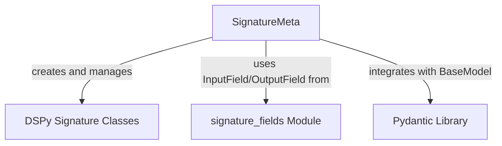

# `signature_meta_class`

## Introduction

The `signature_meta_class` module in DSPy is responsible for defining the `SignatureMeta` metaclass. This metaclass is the core mechanism for creating and managing DSPy `Signature` classes. It provides the foundational logic for parsing signature strings, validating input and output fields, inferring types, and generating the necessary structure for DSPy's language model interactions.

## Core Functionality

The `SignatureMeta` metaclass streamlines the creation of DSPy `Signature` objects, which are blueprints for prompt engineering. Its primary responsibilities include:

-   **Dynamic Signature Creation**: When a `Signature` class is defined, `SignatureMeta` intercepts the creation process to dynamically parse the signature string (e.g., `"question, context -> answer"`) and configure the corresponding input and output fields.
-   **Custom Type Detection**: It intelligently attempts to detect custom Python types used in signature definitions by inspecting the caller's execution frame. This reduces boilerplate by inferring types that are not explicitly provided.
-   **Field Validation**: Ensures that all fields within a `Signature` are correctly declared as either `InputField` or `OutputField`, maintaining consistency and clarity in signature definitions.
-   **Automatic Field Details**: Infers default prefixes and descriptive text (`desc`) for fields if they are not explicitly specified, simplifying signature definitions for developers.
-   **Structured Field Access**: Provides convenient properties (`instructions`, `input_fields`, `output_fields`, `fields`, `signature`) to access the parsed components of a signature, enabling programmatic interaction with the signature's structure.

## Architecture and Component Relationships

The `signature_meta_class` module, centered around the `SignatureMeta` metaclass, plays a crucial role in how DSPy signatures are defined and managed. It integrates with Pydantic for model validation and leverages specific field types provided by the `signature_fields` module.

<!-- DIAGRAM_JSON
{
    "direction": "TD",
    "nodes": [
        {"id": "signature_meta", "label": "SignatureMeta", "type": "component", "link": null},
        {"id": "signature_class", "label": "DSPy Signature Classes", "type": "component", "link": null},
        {"id": "signature_fields_module", "label": "signature_fields Module", "type": "external", "link": "signature_fields.md"},
        {"id": "pydantic_library", "label": "Pydantic Library", "type": "external", "link": null}
    ],
    "edges": [
        {"source": "signature_meta", "target": "signature_class", "label": "creates and manages"},
        {"source": "signature_meta", "target": "signature_fields_module", "label": "uses InputField/OutputField from"},
        {"source": "signature_meta", "target": "pydantic_library", "label": "integrates with BaseModel"}
    ],
    "groups": []
}
-->

### Relationships:

-   **`SignatureMeta`**: This is the core metaclass. It orchestrates the creation of DSPy `Signature` classes.
-   **DSPy Signature Classes**: These are the actual `Signature` objects defined by developers using the `SignatureMeta` metaclass. `SignatureMeta` ensures their proper structure and validation.
-   **`signature_fields` Module**: `SignatureMeta` relies on definitions from the `signature_fields` module, specifically `InputField` and `OutputField`, to correctly classify and validate the fields within a `Signature`. For more details, refer to the [signature_fields module documentation](signature_fields.md).
-   **Pydantic Library**: `SignatureMeta` integrates with Pydantic's `BaseModel` to provide robust data validation and serialization capabilities for `Signature` objects. The metaclass itself inherits from `type(BaseModel)` to leverage Pydantic's metaclass behavior.

## How it Fits into the Overall System

The `signature_meta_class` module is a fundamental building block within the DSPy framework, providing the necessary infrastructure for defining and managing language model signatures. It sits within the `dspy_signatures` ecosystem and is critical for several key aspects of DSPy:

-   **Foundation for Prompt Engineering**: It provides the standardized way to declare the inputs and outputs for any DSPy `Module`, effectively defining the "prompt" structure for language models.
-   **Enables Modularity**: By enforcing a clear structure for signatures, it allows for the modular composition of DSPy programs, where different modules can expect and produce data in a consistent format.
-   **Simplifies DSPy Module Development**: Developers defining new DSPy modules leverage `SignatureMeta` implicitly when they create `Signature` subclasses, significantly simplifying the process of interacting with language models.
-   **Supports Optimization and Teleprompting**: The well-defined and inspectable nature of signatures, facilitated by `SignatureMeta`, is essential for DSPy's advanced teleprompting and optimization techniques, as these often involve analyzing and transforming signature structures.

In essence, `signature_meta_class` is a silent workhorse that ensures the integrity and usability of all `Signature` definitions across the DSPy framework, enabling robust and flexible language model programming.