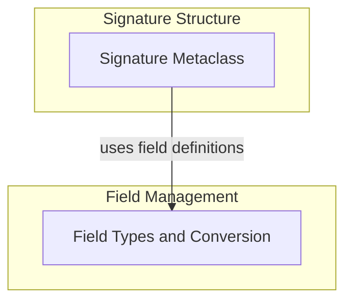

# Signature and Field Definitions
This module defines the foundational structures for DSPy signatures, including classes for input/output fields and a metaclass for dynamic signature creation and validation, essential for structuring prompt interactions.

<!-- DIAGRAM_JSON
{
    "direction": "TD",
    "nodes": [
        {"id": "signature_core", "label": "Signature Metaclass", "type": "module", "link": "signature_core.md"},
        {"id": "field_definitions", "label": "Field Types and Conversion", "type": "module", "link": "field_definitions.md"}
    ],
    "edges": [
        {"source": "signature_core", "target": "field_definitions", "label": "uses field definitions"}
    ],
    "groups": [
        {"id": "signature_structure", "label": "Signature Structure", "role": "analytical", "nodes": ["signature_core"]},
        {"id": "field_management", "label": "Field Management", "role": "analytical", "nodes": ["field_definitions"]}
    ]
}
-->
