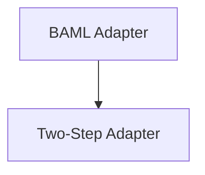

# Specialized Adapters

The `specialized_adapters` module provides advanced adapter implementations designed to optimize interactions with Language Models (LMs) for specific use cases. These adapters extend the base `Adapter` interface, offering specialized formatting, parsing, and interaction strategies to improve the efficiency and accuracy of LM-based programs.

## Architecture Overview

The `specialized_adapters` module integrates closely with the core DSPy framework, building upon the `dspy.adapters.base.Adapter` to provide enhanced functionalities. It currently includes two distinct adapters:

1.  **BAMLAdapter**: Focuses on improving the rendering and parsing of complex Pydantic models for LMs, making structured outputs more manageable and token-efficient.
2.  **TwoStepAdapter**: Implements a two-stage approach, utilizing a main LM for general processing and a smaller, specialized LM for precise structured data extraction from the main LM's response.

<!-- DIAGRAM_JSON
{
    "direction": "TD",
    "nodes": [
        {"id": "baml_adapter", "label": "BAML Adapter", "type": "module", "link": "baml_adapter.md"},
        {"id": "two_step_adapter", "label": "Two-Step Adapter", "type": "module", "link": "two_step_adapter.md"}
    ],
    "edges": [
        {"source": "baml_adapter", "target": "two_step_adapter"}
    ],
    "groups": []
}
-->

## Sub-modules

This module contains the following specialized adapter implementations:

*   [BAML Adapter](baml_adapter.md): An adapter that enhances the rendering of complex Pydantic models for Language Models, inspired by BAML's JSON formatter.
*   [Two-Step Adapter](two_step_adapter.md): A two-stage adapter that uses a main LM for natural language processing and a smaller LM for structured data extraction.

For more details on each adapter, refer to their respective documentation files.