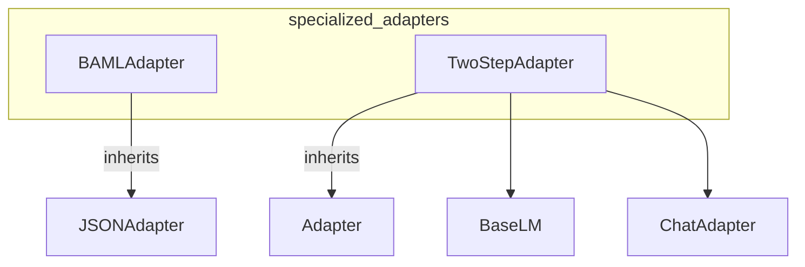

# specialized_adapters
The `specialized_adapters` module provides two DSPy adapters: `BAMLAdapter` for improved Pydantic model rendering and `TwoStepAdapter` for multi-stage LM interactions with a dedicated extraction model.

<!-- DIAGRAM_JSON
{
  "nodes": [
    {"id": "BAMLAdapter", "label": "BAMLAdapter", "type": "class"},
    {"id": "TwoStepAdapter", "label": "TwoStepAdapter", "type": "class"},
    {"id": "JSONAdapter", "label": "JSONAdapter", "type": "class"},
    {"id": "Adapter", "label": "Adapter", "type": "class"},
    {"id": "BaseLM", "label": "BaseLM", "type": "class"},
    {"id": "ChatAdapter", "label": "ChatAdapter", "type": "class"}
  ],
  "edges": [
    {"source": "BAMLAdapter", "target": "JSONAdapter", "type": "inherits"},
    {"source": "TwoStepAdapter", "target": "Adapter", "type": "inherits"},
    {"source": "TwoStepAdapter", "target": "BaseLM", "type": "uses"},
    {"source": "TwoStepAdapter", "target": "ChatAdapter", "type": "uses"}
  ],
  "groups": [
    {"id": "specialized_adapters", "label": "specialized_adapters", "nodes": ["BAMLAdapter", "TwoStepAdapter"]}
  ]
}
-->
