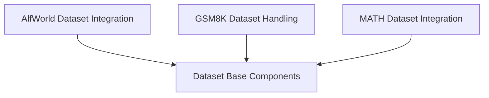

# Specialized Datasets Module

## Introduction

The `specialized_datasets` module within `dspy.datasets` provides specialized dataset classes and utilities for specific benchmarks and environments, such as AlfWorld, GSM8K, and MATH. This module facilitates the loading, preprocessing, and evaluation of these datasets for use in DSPy programs.

## Architecture Overview

The `specialized_datasets` module is structured into several sub-modules, each dedicated to a particular dataset. This design promotes modularity and allows for tailored handling of each dataset's unique characteristics, including data loading, formatting, and evaluation metrics. It builds upon the foundational `dataset_base_components` to provide concrete implementations for specific use cases.

<!-- DIAGRAM_JSON
{
    "direction": "TD",
    "nodes": [
        {"id": "alfworld_dataset", "label": "AlfWorld Dataset Integration", "type": "module", "link": "alfworld_dataset.md"},
        {"id": "gsm8k_dataset", "label": "GSM8K Dataset Handling", "type": "module", "link": "gsm8k_dataset.md"},
        {"id": "math_dataset", "label": "MATH Dataset Integration", "type": "module", "link": "math_dataset.md"}
    ],
    "edges": [
        {"source": "alfworld_dataset", "target": "dataset_base_components"},
        {"source": "gsm8k_dataset", "target": "dataset_base_components"},
        {"source": "math_dataset", "target": "dataset_base_components"}
    ],
    "groups": []
}
-->

## Sub-modules

Here's an overview of the sub-modules within `specialized_datasets`:

- ### [AlfWorld Dataset Integration](alfworld_dataset.md)
  This sub-module provides functionalities for integrating with the AlfWorld environment, including managing dataset loading and environment workers for task execution.

- ### [GSM8K Dataset Handling](gsm8k_dataset.md)
  This sub-module is responsible for handling the loading, processing, and metric calculation for the GSM8K mathematical reasoning dataset.

- ### [MATH Dataset Integration](math_dataset.md)
  This sub-module facilitates the loading of the MATH dataset and includes the necessary evaluation metrics for mathematical problem-solving tasks.
