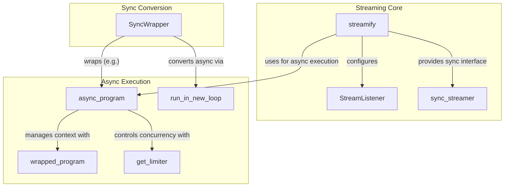

# streaming_and_async
Provides utilities for streaming outputs from DSPy programs and converting between synchronous and asynchronous execution models, managing concurrency and context.

<!-- DIAGRAM_JSON
{
    "nodes": [
        {
            "id": "run_in_new_loop",
            "label": "run_in_new_loop",
            "type": "Function"
        },
        {
            "id": "streamify",
            "label": "streamify",
            "type": "Function"
        },
        {
            "id": "sync_streamer",
            "label": "sync_streamer",
            "type": "Function"
        },
        {
            "id": "StreamListener",
            "label": "StreamListener",
            "type": "Class"
        },
        {
            "id": "wrapped_program",
            "label": "wrapped_program",
            "type": "Function"
        },
        {
            "id": "async_program",
            "label": "async_program",
            "type": "Function"
        },
        {
            "id": "get_limiter",
            "label": "get_limiter",
            "type": "Function"
        },
        {
            "id": "SyncWrapper",
            "label": "SyncWrapper",
            "type": "Class"
        }
    ],
    "edges": [
        {
            "source": "streamify",
            "target": "StreamListener",
            "label": "configures"
        },
        {
            "source": "streamify",
            "target": "sync_streamer",
            "label": "provides sync interface"
        },
        {
            "source": "streamify",
            "target": "async_program",
            "label": "uses for async execution"
        },
        {
            "source": "async_program",
            "target": "wrapped_program",
            "label": "manages context with"
        },
        {
            "source": "async_program",
            "target": "get_limiter",
            "label": "controls concurrency with"
        },
        {
            "source": "SyncWrapper",
            "target": "run_in_new_loop",
            "label": "converts async via"
        },
        {
            "source": "SyncWrapper",
            "target": "async_program",
            "label": "wraps (e.g.)"
        }
    ],
    "groups": [
        {
            "id": "streaming_core",
            "label": "Streaming Core",
            "nodes": [
                "streamify",
                "StreamListener",
                "sync_streamer"
            ]
        },
        {
            "id": "async_execution",
            "label": "Async Execution",
            "nodes": [
                "async_program",
                "wrapped_program",
                "get_limiter",
                "run_in_new_loop"
            ]
        },
        {
            "id": "sync_conversion",
            "label": "Sync Conversion",
            "nodes": [
                "SyncWrapper"
            ]
        }
    ]
}
-->
