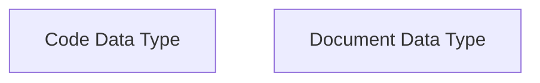

# Structured Text Data Module

The `structured_text_data` module, part of `dspy.adapters.types`, provides robust definitions for handling structured text formats within DSPy programs. It includes specialized types for representing executable code and citeable documents, facilitating advanced language model interactions such as code generation, code analysis, and citation-aware content generation.

## Architecture Overview

This module defines two primary data types:

*   **Code Data Type**: Encapsulates code snippets, enabling their use as inputs or outputs in DSPy signatures for tasks like code generation and analysis.
*   **Document Data Type**: Represents textual content with optional metadata, designed to support citation features in language models, particularly for generating grounded responses.

These types are fundamental for building sophisticated DSPy applications that require precise handling of structured text content.

<!-- DIAGRAM_JSON
{
    "direction": "TD",
    "nodes": [
        {"id": "code_data_type", "label": "Code Data Type", "type": "module", "link": "code_data_type.md"},
        {"id": "document_data_type", "label": "Document Data Type", "type": "module", "link": "document_data_type.md"}
    ],
    "edges": [],
    "groups": []
}
-->

## Sub-modules

*   ### [Code Data Type](code_data_type.md)
    Defines the `Code` type for representing and handling code snippets, useful in code generation and analysis tasks.

*   ### [Document Data Type](document_data_type.md)
    Defines the `Document` type for encapsulating text content and metadata, enabling citation-aware responses from language models.