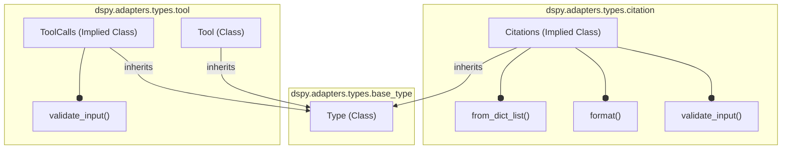

# structured_types
This module defines core structured types for DSPy, including a base `Type` class for custom data structures, specialized `Tool` and `Citations` types, and their associated validation and formatting methods.

<!-- DIAGRAM_JSON
{
  "nodes": [
    {"id": "Type", "label": "Type"},
    {"id": "Citations_from_dict_list", "label": "from_dict_list()"},
    {"id": "Citations_format", "label": "format()"},
    {"id": "Citations_validate_input", "label": "validate_input()"},
    {"id": "Tool", "label": "Tool"},
    {"id": "ToolCalls_validate_input", "label": "validate_input()"},
    {"id": "Citations_Implied", "label": "Citations (Implied)"},
    {"id": "ToolCalls_Implied", "label": "ToolCalls (Implied)"}
  ],
  "edges": [
    {"source": "Tool", "target": "Type", "label": "inherits", "type": "inheritance"},
    {"source": "Citations_Implied", "target": "Type", "label": "inherits", "type": "inheritance"},
    {"source": "ToolCalls_Implied", "target": "Type", "label": "inherits", "type": "inheritance"},
    {"source": "Citations_Implied", "target": "Citations_from_dict_list", "label": "contains", "type": "composition"},
    {"source": "Citations_Implied", "target": "Citations_format", "label": "contains", "type": "composition"},
    {"source": "Citations_Implied", "target": "Citations_validate_input", "label": "contains", "type": "composition"},
    {"source": "ToolCalls_Implied", "target": "ToolCalls_validate_input", "label": "contains", "type": "composition"}
  ],
  "groups": [
    {"id": "base_type", "label": "dspy.adapters.types.base_type", "nodes": ["Type"]},
    {"id": "citation", "label": "dspy.adapters.types.citation", "nodes": ["Citations_Implied", "Citations_from_dict_list", "Citations_format", "Citations_validate_input"]},
    {"id": "tool", "label": "dspy.adapters.types.tool", "nodes": ["Tool", "ToolCalls_Implied", "ToolCalls_validate_input"]}
  ]
}
-->
